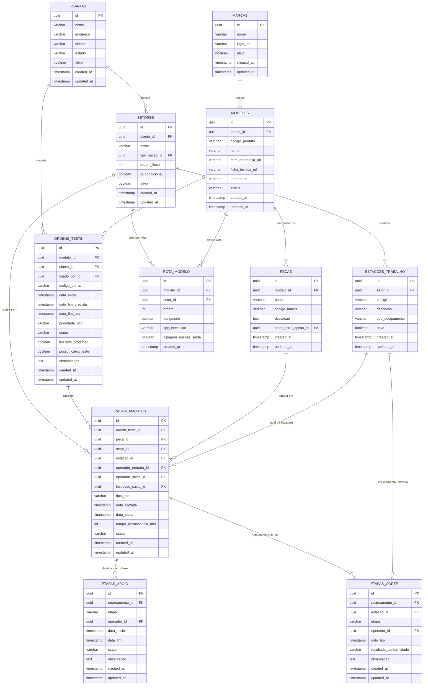
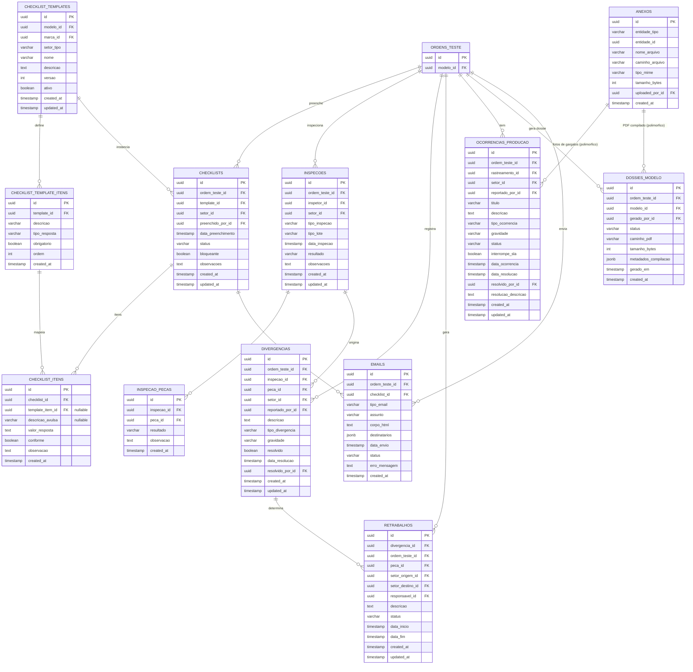

# Guia de Deploy de Banco de Dados — ERP Chão de Fábrica

Este documento fornece as diretrizes arquiteturais, diagramas lógicos de entidade-relacionamento e o guia passo a passo para a implantação do banco de dados relacional (PostgreSQL) do **ERP Chão de Fábrica v4.0** em ambientes de produção.

---

## 1. Diagramas de Entidade-Relacionamento (ERD)

Para facilitar a leitura da modelagem composta por **32 tabelas**, dividimos a arquitetura em dois subgrupos lógicos:

### 1.1 Diagrama 1: O "Coração da Produção"
Este subgrupo foca na infraestrutura física da fábrica, no cadastro de produtos e rastreabilidade principal de peças/lotes, além do detalhamento de micro-fluxos operacionais (Apoio e Corte por Máquina).



---

### 1.2 Diagrama 2: A "Qualidade Onipresente"
Este subgrupo foca no ciclo de garantia de qualidade (Checklists Dinâmicos, Inspeções de Qualidade, Divergências, Retrabalho Cirúrgico, Apontamento de Ocorrências com Fotos e Dossiê PDF Final).



---

## 2. Passo a Passo para o Servidor de Produção Real

Este roteiro destina-se a Administradores de Banco de Dados (DBAs) ou Engenheiros DevOps encarregados do deploy do banco de dados no ambiente produtivo corporativo.

### Passo 2.1: Isolamento de Schema no PostgreSQL
Para garantir que as tabelas de modelagem e testes não se misturem com outras tabelas da base corporativa compartilhada (evitando colisões), deve-se criar um namespace (schema) isolado.

O DBA deve acessar o servidor PostgreSQL alvo e executar o seguinte comando SQL:

```sql
-- Criar a gaveta isolada para o ERP de Modelagem
CREATE SCHEMA IF NOT EXISTS erp_modelagem;

-- Opcional: conceder permissões para o usuário da aplicação
ALTER SCHEMA erp_modelagem OWNER TO seu_usuario_aplicacao;
```

---

### Passo 2.2: Configuração das Variáveis de Ambiente (`.env`)
No servidor de produção real (ou nas variáveis de ambiente da pipeline de CI/CD), as seguintes chaves do `.env` devem ser configuradas para apontar corretamente para o schema isolado:

```env
# Ambiente de Execução
NODE_ENV=production

# Configurações de Conexão com o PostgreSQL Corporativo
DB_HOST=10.0.0.12               # IP ou host do servidor de banco em produção
DB_PORT=5432                    # Porta do PostgreSQL
DB_NAME=sobracorte              # Banco de dados corporativo principal
DB_USER=seu_usuario_aplicacao   # Usuário com permissão no schema erp_modelagem
DB_PASS=sua_senha_segura        # Senha em produção

# Schema Isolado do ERP de Modelagem (Crucial)
DB_SCHEMA=erp_modelagem
```

---

### Passo 2.3: Execução de Migrações em Produção (CI/CD ou Console)

Para efetuar a criação de tabelas, índices e relacionamentos sem risco de perda de dados e mantendo o histórico de controle de schema, a aplicação deve rodar as migrations.

#### Cenário A: Pipeline de CI/CD (Recomendado)
A pipeline de build/deploy deve executar o comando como um step de "Pre-deploy" (logo após a instalação de dependências e compilação do TypeScript):

```bash
# 1. Instalar dependências necessárias
npm ci --only=production

# 2. Compilar TypeScript em JavaScript
npm run build

# 3. Rodar as migrações (conecta no banco e aplica as deltas de DDL)
npm run migration:run
```

#### Cenário B: Execução Manual no Servidor
Se o deploy for manual, o engenheiro DevOps deve abrir o terminal na raiz do projeto configurado no servidor e executar:

```bash
npm run migration:run
```

#### Logs Esperados no Terminal:
```text
query: CREATE TABLE "erp_modelagem"."plantas" ...
query: CREATE TABLE "erp_modelagem"."setores" ...
...
Migration InitialMigration1781642463742 has been executed successfully.
```

---

## 3. Estrutura de Controle (TypeORM Metadata)

O TypeORM criará uma tabela chamada `migrations` sob o schema isolado (`erp_modelagem.migrations`). Esta tabela registra o carimbo de data/hora (timestamp) e o nome de cada migração executada, impedindo que a mesma migration rode duas vezes ou cause colisões. 

> [!CAUTION]
> **Nunca** altere, exclua ou manipule manualmente os registros da tabela `erp_modelagem.migrations` em produção, sob o risco de dessincronizar a aplicação e causar falhas de deploy futuras.
