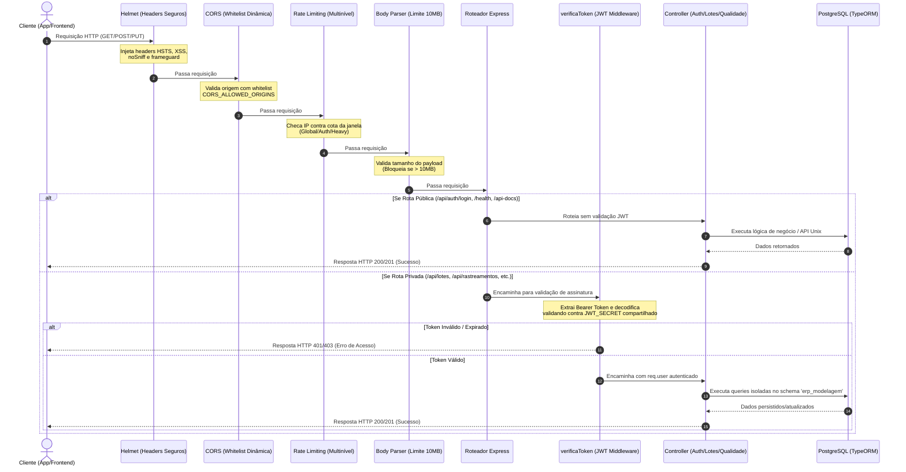

# Postura de Segurança, Controle e Compliance (v4.0)

Este documento descreve as diretrizes arquiteturais de segurança da informação adotadas no ERP de Modelagem para garantir a proteção de dados, integridade operacional e mitigação de vulnerabilidades em conformidade com as melhores práticas de mercado (OWASP API Security Top 10) e integração segura com serviços legados de autenticação Unix.

---

## 1. Visão Executiva e Níveis de Defesa

Nossa API Express é blindada por uma arquitetura de segurança multicamadas que intercepta a requisição desde o nível de transporte até a camada de roteamento lógico. Nenhuma operação prossegue sem passar por todas as barreiras.

```
┌─────────────────────────────────────────────────────────────────────────┐
│                     Requisição do Cliente (HTTP/S)                      │
└────────────────────────────────────┬────────────────────────────────────┘
                                     ▼
┌─────────────────────────────────────────────────────────────────────────┐
│ 1. Transporte Seguro: Helmet (HSTS, Anti-Clickjacking, CSP)             │
└────────────────────────────────────┬────────────────────────────────────┘
                                     ▼
┌─────────────────────────────────────────────────────────────────────────┐
│ 2. Controle de Acesso de Rede: CORS Whitelisting Dinâmico               │
└────────────────────────────────────┬────────────────────────────────────┘
                                     ▼
┌─────────────────────────────────────────────────────────────────────────┐
│ 3. Proteção contra Sobrecarga: Tríade de Rate Limiting (Global/Auth/Heavy)│
└────────────────────────────────────┬────────────────────────────────────┘
                                     ▼
┌─────────────────────────────────────────────────────────────────────────┐
│ 4. Controle de Payload: Body Parser Limite (10MB)                       │
└────────────────────────────────────┬────────────────────────────────────┘
                                     ▼
┌─────────────────────────────────────────────────────────────────────────┐
│ 5. Autenticação e RBAC: Middleware verificaToken (JWT Compartilhado)    │
└────────────────────────────────────┬────────────────────────────────────┘
                                     ▼
┌─────────────────────────────────────────────────────────────────────────┐
│ 6. Controlador Lógico (Controller / TypeORM Database Upsert)            │
└────────────────────────────────────────────────────────────────_________┘
```

### 1.1 Camadas de Infraestrutura e Transporte (Helmet & CORS)
* **Helmet:** Força o uso do cabeçalho `Strict-Transport-Security` (HSTS) por 1 ano para evitar downgrades de protocolo, define regras estritas de Content Security Policy (CSP) seguras para a execução do Swagger UI e previne ataques de MIME-sniffing e Clickjacking (`frameguard: deny`). Oculta o header `X-Powered-By` para dificultar a engenharia reversa sobre a stack de backend.
* **CORS Dinâmico:** A whitelist de origens permitidas é importada do arquivo `.env` via `CORS_ALLOWED_ORIGINS` para evitar origens permissivas ou curingas (`*`) em ambientes produtivos, garantindo a passagem segura de cookies e tokens de autorização (`credentials: true`).

### 1.2 A "Tríade de Rate Limiting"
Para evitar ataques distribuídos de negação de serviço (DDoS), força bruta no login e exaustão de recursos de CPU/Memória na compilação de relatórios, implementamos restrições multinível via `express-rate-limit`:

1. **Global (`globalLimiter`):**
   * **Escopo:** Aplicado a todos os endpoints do barramento de API (`/api/*`).
   * **Limite:** Máximo de 200 requisições a cada janela de 15 minutos por IP.
   * **Objetivo:** Mitigar spam de requisições gerais e ferramentas de scraping automatizadas.
2. **Autenticação (`authLimiter`):**
   * **Escopo:** Aplicado exclusivamente a tentativas de login (`/api/auth/login`).
   * **Limite:** Máximo de 5 tentativas a cada 15 minutos.
   * **Mecanismo:** Requisições bem-sucedidas são ignoradas (`skipSuccessfulRequests: true`), punindo apenas tentativas consecutivas de erro com bloqueio temporário do IP da janela.
   * **Objetivo:** Mitigar ataques de brute-force e credential stuffing.
3. **Operações Pesadas (`heavyLimiter`):**
   * **Escopo:** Aplicado a barramentos de exportações de PDFs, dossiês automatizados e dashboards (`/api/relatorios/*`, `/api/dossies/*`).
   * **Limite:** Máximo de 10 requisições por hora.
   * **Objetivo:** Prevenir a exaustão térmica do servidor por compilação repetitiva de arquivos PDF pesados (Genkit) e queries complexas de BI.

---

## 2. Diagrama de Fluxo de Segurança (Ciclo de Vida da Requisição)

O diagrama abaixo demonstra o caminho percorrido por uma requisição HTTP enviada à nossa API REST até obter resposta, detalhando a separação entre rotas públicas e rotas protegidas por JWT.



---

## 3. Autenticação e Integração Legada (O Espelho Dinâmico Unix)

### 3.1 O Mecanismo de SSO e Upsert
Em vez de trafegar ou expor senhas dos usuários localmente no banco de dados do ERP (risco de vazamento), adotamos um modelo híbrido integrado ao serviço legado Unix (`dass_auth_service`):

1. **Autenticação Externa:** O usuário envia credenciais para o ERP. O ERP repassa via `axios` em uma chamada HTTP para a rede privada Docker (`${DASS_AUTH_URL}/auth/login`).
2. **Shared Secret Validation:** Validado com sucesso no Unix, o serviço legada retorna um token assinado. O ERP compartilha do mesmo `JWT_SECRET` do Unix, permitindo que nossos middlewares validem o token em qualquer rota privada.
3. **Espelhamento Dinâmico (Zero Hardcode):**
   * O ERP intercepta os dados decodificados do token (`nomeCompleto`, `usuario`, `email`, `cargo`).
   * Realiza uma busca na tabela local de usuários. Se o operador já existir, atualiza seus dados básicos para refletir mudanças do Unix (sincronização automática de cadastro).
   * Se o operador for novo no sistema, realiza o insert imediatamente vinculando o perfil padrão de `'OPERADOR'` e a planta fabril correspondente, marcando a senha hash no PostgreSQL como `'EXTERNAL_AUTH_ONLY'`.
   * **RBAC Sem Código Estático:** Não existem verificações hardcoded no código do backend do tipo `if (user.role === 'admin')`. A atribuição de níveis administrativos (Admin, Supervisor) é feita diretamente pelo banco local alterando a chave de relacionamento `perfilId` do usuário, garantindo portabilidade e flexibilidade.

---

## 4. Mitigação de Riscos — OWASP API Security Top 10 (2023)

| Categoria OWASP | Descrição do Risco | Estratégia de Mitigação Implementada |
| :--- | :--- | :--- |
| **API1:2023 - Broken Object Level Authorization (BOLA)** | Acesso não autorizado a dados manipulando IDs de registros na URL. | Utilização de UUIDv4 para todos os identificadores primários (IDs não sequenciais e imprevisíveis). Validação das claims do JWT no middleware, forçando filtros das buscas com base no ID e Planta extraídos do token verificado. |
| **API2:2023 - Broken Authentication** | Falhas na validação de identidade e fraqueza de tokens de sessão. | Autenticação centralizada em serviço Unix legado com tokens JWT. Validação rígida de expiração do token no middleware `verificaToken` e bloqueio de força bruta de credenciais pelo middleware `authLimiter`. |
| **API3:2023 - Broken Object Property Level Authorization** | Exposição excessiva de propriedades e dados confidenciais do usuário. | Higienização de DTOs e entidades TypeORM antes do envio de respostas HTTP. A senha criptografada (`senha_hash`) nunca é retornada nas APIs de usuários, blindando o banco contra exposição. |
| **API4:2023 - Unrestricted Resource Consumption** | Falta de limites em requisições que causam gargalo e negação de serviço. | Tríade de rate limiters atuando por escopo (Global, Login e Exportações Pesadas) e limitação estrita de payloads JSON a 10MB no Body Parser. |
| **API5:2023 - Broken Function Level Authorization (BFLA)** | Usuários comuns acessando funções administrativas sem validação de papel. | Middleware de verificação de permissão dinâmico baseado em controle de acesso granular de perfis (`perfilId`), com mapeamento das ações no banco e sem regras fixas no código. |
| **API6:2023 - Unrestricted Access to Sensitive Business Flows** | Abuso de fluxos sensíveis e críticos por robôs ou spammers. | Aplicação de Rate Limiter rígido no login (máximo de 5 tentativas em 15 minutos com bloqueio imediato por IP) e na geração de dossiês. |
| **API7:2023 - Server Side Request Forgery (SSRF)** | Requisições maliciosas enviadas do próprio servidor para redes internas. | Endpoints das APIs legadas acessadas apenas por caminhos restritos e parametrizados em variáveis de ambiente controladas (`DASS_AUTH_URL` na rede Docker privada). |
| **API8:2023 - Security Misconfiguration** | Configurações incorretas de CORS, headers ou mensagens de depuração excessivas. | Configuração estrita de Helmet e CORS por whitelist parametrizável. Middleware `errorHandler` centralizado que intercepta e sanitiza mensagens de erro em produção, omitindo stack traces do Node e nomes físicos de tabelas do banco de dados. |
| **API9:2023 - Improper Inventory Management** | APIs antigas ou de testes expostas sem documentação ou segurança. | Documentação interativa OpenAPI 3.0 centralizada em `/api-docs` gerada dinamicamente via JSDoc de desenvolvimento com caminhos absolutos, garantindo consistência com o código em execução. |
| **API10:2023 - Unsafe Consumption of APIs** | Confiança cega em APIs externas e terceiros com falhas de tratamento de retorno. | Encapsulamento das comunicações externas (`dass_auth_service`) usando instâncias isoladas do `axios` blindadas por blocos try-catch e fallbacks tolerantes a falhas no parsing de payloads do Unix. |
