# Arquitetura de Dados — ERP Chão de Fábrica (Testes de Produção) — v4.0

> **Stack**: Vue.js 3 · Tailwind CSS · Node.js · Express · TypeORM · PostgreSQL · TypeScript · Axios · Genkit 2.0 · Docker · Swagger/OpenAPI 3.0

---

## Changelog Completo

### v3.5 → v4.0 (Segurança Enterprise, Infraestrutura Docker & Documentação API — 16/Jun/2026)

| # | Mudança | Detalhe |
|---|---|---|
| 1 | **Segurança Enterprise Blindada** | Middlewares obrigatórios: Helmet (headers HTTP blindados), Rate Limiting por camada (global, auth, operações pesadas), JWT com Access/Refresh Tokens, validação Zod em todas as entradas, proteção contra SQL Injection via TypeORM parameterizado, CORS com whitelist de origens. Skill invocada: `@api-security-best-practices` |
| 2 | **Documentação API Interativa** | Swagger UI em `/api-docs` com OpenAPI 3.0. Todos os endpoints documentados com schemas, exemplos e códigos de erro. Postman Collection exportável para QA. Skill invocada: `@api-documentation` |
| 3 | **Infraestrutura Docker** | `docker-compose.yml` com multi-stage build. Integração via rede `dass_private` com `dass_auth_service` (porta 2399). Variáveis de ambiente para `sobracorte` API (porta 3333). Health checks, resource limits e segurança de containers. Skill invocada: `@docker-expert` |
| 4 | **Variáveis de Ambiente Seguras** | Arquivo `.env.example` documentado. Zero segredos no código-fonte. Validação obrigatória de variáveis críticas no startup |

### v3.4 → v3.5 (Zero Hardcode, Inteligência de KPIs & Flexibilidade — 09/Jun/2026)

| # | Mudança | Detalhe |
|---|---|---|
| 1 | **Dinamismo nos Checklists** | Suporte a itens avulsos em tempo real em `checklist_itens` (com `template_item_id` nullable e coluna `descricao_avulsa`). Genkit flow `dispararEmailChecklist` com e-mail automático em tabela HTML formatada. Regra de trava (se `bloqueante = true` e pendente) vs concessão (se `bloqueante = false`, avança mas alerta) no Handoff Automático |
| 2 | **Fim dos Enums Engessados** | Alteração do campo `tipo` de `setores` para FK que aponta para `config_opcoes`. Remoção do Enum `SetorCorte` em `pecas.setorCorte` para FK a `config_opcoes` (possibilitando adição dinâmica de subsetores como Laser e variação por modelo) |
| 3 | **Pausa de SLA nas Ocorrências** | Campo `interrompeSla` em `ocorrencias_producao`. Ajuste no cálculo de `tempoPermanenciaMin` e KPI A (Lead Time) para deduzir o tempo em que o relógio esteve pausado por ocorrências impeditivas |

### v3.3 → v3.4 (Desburocratização & Reunião de Resultado — 05/Jun/2026)

| # | Mudança | Detalhe |
|---|---|---|
| 1 | **Handoff Automático na Fase Inicial** | Removida exigência de Inspetora de Qualidade para saída de Almoxarifado, Navalha, Telas, Recebimento, Separação e Dublagem. Simples bipagem de saída pelo responsável já caracteriza o avanço |
| 2 | **Fechamento do Coordenador — Check Binário** | `FECHAMENTO_LOTE` vira check OK / NÃO OK. Campos `resultado_conformidade` e `observacao` (obrigatório se NÃO OK) adicionados a `etapas_corte`. Fotos opcionais via `anexos` polimórfico (`entidade_tipo = 'etapas_corte'`) |
| 3 | **Laboratório no Apoio + Retrabalho Cirúrgico** | Novo `TipoInspecao.LABORATORIO_APOIO` após Fuse e Frequência. Regra global: toda reprovação de Lab ou Qualidade exige seleção do setor de origem, e a peça retorna exatamente àquele ponto |
| 4 | **Reunião de Resultado Final** | Novo status `AGUARDANDO_RESULTADO_FINAL` após Montagem + Qualidade. Apenas perfil `GERENTE_MODELAGEM` pode registrar veredito final em `aprovacoes_finais` e disparar liberação |
| 5 | **Diagramas Mermaid Corrigidos** | Removida Inspetora das fases iniciais. Substituído `FORK`/`JOIN` por `Bifurcação Paralela`/`Sincronização` em todos os diagramas |

### v3.2 → v3.3 (BI & Inteligência Operacional — 03/Jun/2026)

| # | Funcionalidade | Detalhe |
|---|---|---|
| 1 | **Apontamento de Gargalos com Fotos** | Nova tabela `ocorrencias_producao` para registrar problemas em tempo real. Integração com tabela polimórfica `anexos` para upload de fotos do chão de fábrica |
| 2 | **Dossiê do Modelo (PDF Final)** | Nova tabela `dossies_modelo` + Genkit flow `gerarDossieModelo` que compila rastreamentos, tempos, checklists, divergências e fotos em PDF definitivo após aprovação no Laboratório |
| 3 | **Dashboard Gerencial de BI** | 4 KPIs operacionais: (A) Lead Time Caixa Teste vs Lote Principal, (B) Mapa de Gargalos em Tempo Real com fotos, (C) FPY — First Pass Yield, (D) Índice de Retrabalho por Setor |

### v3.1 → v3.2 (Corte por Máquina & RBAC Dinâmico — 03/Jun/2026)

| # | Correção | Detalhe |
|---|---|---|
| 1 | **Dupla Bipagem no Corte** | Nova tabela `etapas_corte` vinculada ao rastreamento principal. Dois bips sequenciais por máquina: (A) 'Revisao_Maquina' (Revisora) registrando a máquina específica, (B) 'Fechamento_Lote' (Coordenador do Setor) |
| 2 | **Atom = Corte por Máquina** | Mapeamento explícito de `CORTE_ATOM` como 'Corte Automático por Máquina' operando com facas oscilantes. Handoff pós-coordenador via `Assistente de Modelagem` |
| 3 | **RBAC Dinâmico "Zero Hardcode"** | Nova tabela `perfil_permissoes` para relacionar perfis, setores e ações. Validação dinâmica no backend e Tela de Gestão de Usuários e Permissões no painel admin |

### v3 → v3.1 (Correções Visuais e de Regras — 03/Jun/2026)

| # | Correção | Detalhe |
|---|---|---|
| 1 | **Siglas eliminadas** | "CP" → "Costura Programada" · "QA" → "Inspetora de Qualidade" em todo o documento |
| 2 | **Micro-fluxo do Corte Automático** | Diagrama detalhado: Recebimento → Separação → Dublagem → distribuição paralela por sub-setor |
| 3 | **Vulcanizado = Condicional + Paralelo** | Fork/join explícito com Montagem via `tipoExecucao: PARALELO` |
| 4 | **Qualidade Onipresente visível** | Hexágono "Inspetora de Qualidade" exibido como pedágio obrigatório na saída de CADA macrosetor |
| 5 | **Layout limpo** | 6 diagramas separados em vez de um monólito · Sem subgraphs aninhados · `direction TB` ou `LR` consistente |

### Histórico anterior

| Versão | Mudanças-chave |
|---|---|
| v3 | Caixa Teste · Qualidade Onipresente · Laboratório · Micro-fluxo Apoio · Costura Programada flutuante · Construtor de Rota |
| v2 | Telas paralelo · Apoio · Pré-Fabricado flutuante · Vulcanizado condicional · Dashboard Qualidade + Genkit AI |
| v1 | Arquitetura inicial: 26 tabelas, fluxo linear |

---

## Contexto Consolidado (Sabatina + v2 + v3 + v3.1 + v3.2 + v3.3 + v3.4 + v3.5 + v4.0)

| Dimensão | Decisão |
|---|---|
| **Escala** | 10–20 usuários simultâneos · 1–5 OPs/dia · 10 estações de bipagem · Multi-planta |
| **Unidade rastreável** | **Peça** (cada peça cortada individualmente) · Com `tipoLote` para separar CAIXA_TESTE do LOTE_PRINCIPAL |
| **Caixa Teste** | Lote antecipado que corre na frente (ex: tam. 40 Fila, 10 Nike). Opera assincronamente ao lote principal |
| **Fase inicial** | **Paralela**: Almoxarifado + Navalha + Telas operam simultaneamente com **Handoff Automático** (sem inspeção de saída, mas validando checklists com regra de trava/concessão) |
| **Corte Automático** | Recebimento → Separação → Dublagem com Handoff Automático. Distribuição paralela dinâmica (conforme `pecas.setorCorteOpcaoId` apontando para opções como Ponte, Lectra, Atom, CN, Couro, Laser) com dupla bipagem por máquina. Coordenador faz check OK/NÃO OK. 1ª inspeção obrigatória SOMENTE após recolhimento pela Assistente de Modelagem |
| **Setores condicionais** | Serigrafia · Vulcanizado (condicional **e paralelo** com Montagem) · Bordado |
| **Setores flutuantes** | Pré-Fabricado · Costura Programada · Bordado — posição definida pelo Modelista via Construtor de Rota |
| **Setor de Apoio** | Micro-fluxo: Corte → Chanfração/Etiqueta/Prensagem → Fuse + Frequência → **Teste Lab Apoio** → Recorte. Bipagem apenas na saída final |
| **Laboratório no Apoio** | Testes obrigatórios de Fuse/Frequência antes do Recorte via `TipoInspecao.LABORATORIO_APOIO` |
| **Retrabalho Cirúrgico** | Toda reprovação de Lab ou Qualidade exige seleção do setor de origem (via `retrabalhos.setorDestinoId`). A peça retorna exatamente àquele ponto |
| **Costura Programada** | Antigo "Pré-Costura". 100% flutuante |
| **Laboratório** | Setor após Montagem/Vulcanizado. Testes: colagem, flexão, abrasão |
| **Qualidade** | **Seletiva**: gate obrigatório apenas a partir dos subsetores de Corte por Máquina (pós-Assistente). Setores iniciais usam Handoff Automático |
| **Reunião de Resultado Final** | Status `AGUARDANDO_RESULTADO_FINAL` após Montagem. Apenas `GERENTE_MODELAGEM` registra veredito final em `aprovacoes_finais` |
| **Gargalos / Ocorrências** | Operador pode relatar gargalos com foto via `ocorrencias_producao` + `anexos`. Campo `interrompeSla` permite pausar o tempo de permanência |
| **Dossiê do Modelo** | Após aprovação final, PDF compilado via Genkit flow `gerarDossieModelo` |
| **Dashboard Gerencial BI** | 4 KPIs: Lead Time (com desconto de SLA pausado por ocorrências) · Mapa de Gargalos em Tempo Real · FPY · Índice de Retrabalho |
| **Dashboard Qualidade** | Pareto de defeitos + heatmap de reprovações por setor + AI Insights via Genkit |
| **Perfis** | REVISORA · COORDENADOR_SETOR · ASSISTENTE_MODELAGEM · OPERADOR · INSPETOR_QUALIDADE · MODELISTA · SUPERVISOR_SETOR · ALMOXARIFE · **GERENTE_MODELAGEM** · ADMIN |
| **Segurança / RBAC** | **RBAC Dinâmico "Zero Hardcode"** — permissões configuradas via banco de dados (seed) e editáveis via tela administrativa no Frontend. Validação dinâmica no Backend. Remoção de Enums fixos para tipos de setores e peças (agora são dinâmicos via `config_opcoes`). |
| **Dinamismo em Checklists** | Interface aceita itens avulsos em tempo real (template_item_id nullable). E-mail de resultado com tabela HTML gerada e enviada via Genkit de forma automática. |
| **Segurança Enterprise (v4.0)** | JWT Access/Refresh Tokens (compartilhado com `dass_auth_service`), Helmet (headers HTTP), Rate Limiting em 3 camadas (global/auth/heavy), CORS com whitelist via env, Validação Zod em todas as entradas, proteção contra SQL Injection via TypeORM parameterizado, Tratamento de erros sanitizado, Checklist OWASP API Top 10 completo |
| **Infraestrutura Docker (v4.0)** | Multi-stage build (3 estágios: deps/build/runtime), Docker Compose com 3 serviços (erp-modelagem:3001, erp-postgres:5432, erp-redis:6379), rede `dass_private` (external) para comunicação com `dass_auth_service` (porta 2399), rede `erp_internal` isolada, health checks, resource limits, usuário não-root |
| **Integração Legada (v4.0)** | `dass_auth_service` (Node.js/Sequelize, porta 2399, container `main-service`, rede `dass_private`) + `sobracorte` (Node.js/Prisma, porta 3333, host via `host.docker.internal`) |
| **Documentação API (v4.0)** | Swagger UI em `/api-docs` (OpenAPI 3.0), 30+ endpoints documentados com JSDoc annotations, Postman Collection importável via `/api-docs.json`, schemas reutilizáveis (Error, Pagination), 12 tags organizacionais |

---

## 1. Diagrama ER — Arquitetura de Dados (PostgreSQL)

```mermaid
erDiagram
    PLANTAS {
        uuid id PK
        varchar nome
        varchar endereco
        varchar cidade
        varchar estado
        boolean ativo
        timestamp created_at
        timestamp updated_at
    }

    SETORES {
        uuid id PK
        uuid planta_id FK
        varchar nome
        uuid tipo_opcao_id FK
        int ordem_fluxo
        boolean is_condicional
        boolean ativo
        timestamp created_at
        timestamp updated_at
    }

    ESTACOES_TRABALHO {
        uuid id PK
        uuid setor_id FK
        varchar codigo
        varchar descricao
        varchar tipo_equipamento
        boolean ativo
        timestamp created_at
        timestamp updated_at
    }

    PERFIS {
        uuid id PK
        varchar nome
        text descricao
        jsonb permissoes
        boolean ativo
        timestamp created_at
        timestamp updated_at
    }

    PERFIL_PERMISSOES {
        uuid id PK
        uuid perfil_id FK
        uuid setor_id FK
        varchar acao
        boolean permitido
        timestamp created_at
        timestamp updated_at
    }

    USUARIOS {
        uuid id PK
        uuid perfil_id FK
        uuid setor_id FK
        uuid planta_id FK
        uuid gestor_id FK
        varchar nome_completo
        varchar usuario
        varchar senha_hash
        varchar cargo
        varchar email
        boolean ativo
        timestamp ultimo_acesso
        timestamp created_at
        timestamp updated_at
    }

    CONFIG_CATEGORIAS {
        uuid id PK
        varchar slug
        varchar nome_exibicao
        text descricao
        boolean ativo
        timestamp created_at
        timestamp updated_at
    }

    CONFIG_OPCOES {
        uuid id PK
        uuid categoria_id FK
        varchar valor
        varchar label
        int ordem
        boolean ativo
        timestamp created_at
        timestamp updated_at
    }

    MARCAS {
        uuid id PK
        varchar nome
        varchar logo_url
        boolean ativo
        timestamp created_at
        timestamp updated_at
    }

    MODELOS {
        uuid id PK
        uuid marca_id FK
        varchar codigo_produto
        varchar nome
        varchar mfm_referencia_url
        varchar ficha_tecnica_url
        varchar temporada
        varchar status
        timestamp created_at
        timestamp updated_at
    }

    PECAS {
        uuid id PK
        uuid modelo_id FK
        varchar nome
        varchar codigo_barras
        text descricao
        uuid setor_corte_opcao_id FK
        timestamp created_at
        timestamp updated_at
    }

    ROTA_MODELO {
        uuid id PK
        uuid modelo_id FK
        uuid setor_id FK
        int ordem
        boolean obrigatorio
        varchar tipo_execucao
        boolean bipagem_apenas_saida
        timestamp created_at
    }

    ORDENS_TESTE {
        uuid id PK
        uuid modelo_id FK
        uuid planta_id FK
        uuid criado_por_id FK
        varchar codigo_barras
        timestamp data_inicio
        timestamp data_fim_prevista
        timestamp data_fim_real
        varchar prioridade_pcp
        varchar status
        boolean liberado_producao
        boolean possui_caixa_teste
        text observacoes
        timestamp created_at
        timestamp updated_at
    }

    RASTREAMENTOS {
        uuid id PK
        uuid ordem_teste_id FK
        uuid peca_id FK
        uuid setor_id FK
        uuid estacao_id FK
        uuid operador_entrada_id FK
        uuid operador_saida_id FK
        uuid inspecao_saida_id FK
        varchar tipo_lote
        timestamp data_entrada
        timestamp data_saida
        int tempo_permanencia_min
        varchar status
        timestamp created_at
        timestamp updated_at
    }

    ETAPAS_APOIO {
        uuid id PK
        uuid rastreamento_id FK
        varchar etapa
        uuid operador_id FK
        timestamp data_inicio
        timestamp data_fim
        varchar status
        text observacao
        timestamp created_at
        timestamp updated_at
    }

    ETAPAS_CORTE {
        uuid id PK
        uuid rastreamento_id FK
        uuid estacao_id FK
        varchar etapa
        uuid operador_id FK
        timestamp data_bip
        varchar resultado_conformidade
        text observacao
        timestamp created_at
        timestamp updated_at
    }

    %% resultado_conformidade: OK | NAO_OK (preenchido no FECHAMENTO_LOTE)
    %% observacao: obrigatorio quando resultado_conformidade = NAO_OK
    %% Fotos vinculadas via ANEXOS (entidade_tipo = 'etapas_corte')

    CHECKLIST_TEMPLATES {
        uuid id PK
        uuid modelo_id FK
        uuid marca_id FK
        varchar setor_tipo
        varchar nome
        text descricao
        int versao
        boolean ativo
        timestamp created_at
        timestamp updated_at
    }

    CHECKLIST_TEMPLATE_ITENS {
        uuid id PK
        uuid template_id FK
        varchar descricao
        varchar tipo_resposta
        boolean obrigatorio
        int ordem
        timestamp created_at
    }

    CHECKLISTS {
        uuid id PK
        uuid ordem_teste_id FK
        uuid template_id FK
        uuid setor_id FK
        uuid preenchido_por_id FK
        timestamp data_preenchimento
        varchar status
        boolean bloqueante
        text observacoes
        timestamp created_at
        timestamp updated_at
    }

    CHECKLIST_ITENS {
        uuid id PK
        uuid checklist_id FK
        uuid template_item_id FK "nullable"
        varchar descricao_avulsa "nullable"
        text valor_resposta
        boolean conforme
        text observacao
        timestamp created_at
    }

    INSPECOES {
        uuid id PK
        uuid ordem_teste_id FK
        uuid inspetor_id FK
        uuid setor_id FK
        varchar tipo_inspecao
        varchar tipo_lote
        timestamp data_inspecao
        varchar resultado
        text observacoes
        timestamp created_at
        timestamp updated_at
    }

    INSPECAO_PECAS {
        uuid id PK
        uuid inspecao_id FK
        uuid peca_id FK
        varchar resultado
        text observacao
        timestamp created_at
    }

    DIVERGENCIAS {
        uuid id PK
        uuid ordem_teste_id FK
        uuid inspecao_id FK
        uuid peca_id FK
        uuid setor_id FK
        uuid reportado_por_id FK
        text descricao
        varchar tipo_divergencia
        varchar gravidade
        boolean resolvido
        timestamp data_resolucao
        uuid resolvido_por_id FK
        timestamp created_at
        timestamp updated_at
    }

    RETRABALHOS {
        uuid id PK
        uuid divergencia_id FK
        uuid ordem_teste_id FK
        uuid peca_id FK
        uuid setor_origem_id FK
        uuid setor_destino_id FK
        uuid responsavel_id FK
        text descricao
        varchar status
        timestamp data_inicio
        timestamp data_fim
        timestamp created_at
        timestamp updated_at
    }

    VALIDACOES_SETOR {
        uuid id PK
        uuid ordem_teste_id FK
        uuid setor_id FK
        uuid validador_id FK
        timestamp data_validacao
        boolean aprovado
        text comentario
        timestamp created_at
    }

    APROVACOES_FINAIS {
        uuid id PK
        uuid ordem_teste_id FK
        uuid aprovador_id FK
        varchar tipo
        varchar resultado
        text justificativa
        timestamp data_aprovacao
        timestamp created_at
    }

    EMAILS {
        uuid id PK
        uuid ordem_teste_id FK
        uuid checklist_id FK
        varchar tipo_email
        varchar assunto
        text corpo_html
        jsonb destinatarios
        timestamp data_envio
        varchar status
        text erro_mensagem
        timestamp created_at
    }

    INSIGHTS_QUALIDADE {
        uuid id PK
        uuid planta_id FK
        varchar tipo
        jsonb dados_pareto
        jsonb dados_setor_reprovacao
        text resumo_ia
        text recomendacoes_ia
        timestamp periodo_inicio
        timestamp periodo_fim
        timestamp gerado_em
        timestamp created_at
    }

    OCORRENCIAS_PRODUCAO {
        uuid id PK
        uuid ordem_teste_id FK
        uuid rastreamento_id FK
        uuid setor_id FK
        uuid reportado_por_id FK
        varchar titulo
        text descricao
        varchar tipo_ocorrencia
        varchar gravidade
        varchar status
        boolean interrompe_sla
        timestamp data_ocorrencia
        timestamp data_resolucao
        uuid resolvido_por_id FK
        text resolucao_descricao
        timestamp created_at
        timestamp updated_at
    }

    DOSSIES_MODELO {
        uuid id PK
        uuid ordem_teste_id FK
        uuid modelo_id FK
        uuid gerado_por_id FK
        varchar status
        varchar caminho_pdf
        int tamanho_bytes
        jsonb metadados_compilacao
        timestamp gerado_em
        timestamp created_at
    }

    ANEXOS {
        uuid id PK
        varchar entidade_tipo
        uuid entidade_id
        varchar nome_arquivo
        varchar caminho_arquivo
        varchar tipo_mime
        int tamanho_bytes
        uuid uploaded_por_id FK
        timestamp created_at
    }

    AUDIT_LOG {
        uuid id PK
        uuid usuario_id FK
        varchar acao
        varchar entidade_tipo
        uuid entidade_id
        jsonb dados_anteriores
        jsonb dados_novos
        varchar ip_address
        timestamp created_at
    }

    %% ═══ RELACIONAMENTOS ═══

    PLANTAS ||--o{ SETORES : "possui"
    PLANTAS ||--o{ USUARIOS : "lotado em"
    PLANTAS ||--o{ ORDENS_TESTE : "executa"
    PLANTAS ||--o{ INSIGHTS_QUALIDADE : "analisa"

    SETORES ||--o{ ESTACOES_TRABALHO : "contem"
    SETORES ||--o{ RASTREAMENTOS : "registra em"
    SETORES ||--o{ ROTA_MODELO : "compoe rota"
    SETORES ||--o{ VALIDACOES_SETOR : "validado em"
    SETORES ||--o{ CHECKLISTS : "aplicado em"
    SETORES ||--o{ INSPECOES : "inspecionado em"
    SETORES ||--o{ DIVERGENCIAS : "ocorre em"
    SETORES ||--o{ RETRABALHOS : "origem"
    SETORES ||--o{ PERFIL_PERMISSOES : "restrito a"

    PERFIS ||--o{ USUARIOS : "define acesso"
    PERFIS ||--o{ PERFIL_PERMISSOES : "possui"

    USUARIOS ||--o{ USUARIOS : "gestor de"
    USUARIOS ||--o{ RASTREAMENTOS : "bipa entrada"
    USUARIOS ||--o{ CHECKLISTS : "preenche"
    USUARIOS ||--o{ INSPECOES : "inspeciona"
    USUARIOS ||--o{ DIVERGENCIAS : "reporta"
    USUARIOS ||--o{ APROVACOES_FINAIS : "aprova"
    USUARIOS ||--o{ VALIDACOES_SETOR : "valida"
    USUARIOS ||--o{ ORDENS_TESTE : "cria"
    USUARIOS ||--o{ ANEXOS : "faz upload"
    USUARIOS ||--o{ AUDIT_LOG : "registrado"
    USUARIOS ||--o{ ETAPAS_APOIO : "executa etapa"
    USUARIOS ||--o{ ETAPAS_CORTE : "realiza bip de corte"

    CONFIG_CATEGORIAS ||--o{ CONFIG_OPCOES : "contem opcoes"
    CONFIG_OPCOES ||--o{ SETORES : "tipo do setor"
    CONFIG_OPCOES ||--o{ PECAS : "corte da peca"

    MARCAS ||--o{ MODELOS : "possui"
    MARCAS ||--o{ CHECKLIST_TEMPLATES : "regras por marca"

    MODELOS ||--o{ PECAS : "composto por"
    MODELOS ||--o{ ROTA_MODELO : "define rota"
    MODELOS ||--o{ ORDENS_TESTE : "gera teste"
    MODELOS ||--o{ CHECKLIST_TEMPLATES : "template por modelo"

    ORDENS_TESTE ||--o{ RASTREAMENTOS : "rastreia"
    ORDENS_TESTE ||--o{ CHECKLISTS : "preenche"
    ORDENS_TESTE ||--o{ INSPECOES : "inspeciona"
    ORDENS_TESTE ||--o{ DIVERGENCIAS : "registra"
    ORDENS_TESTE ||--o{ RETRABALHOS : "gera"
    ORDENS_TESTE ||--o{ APROVACOES_FINAIS : "aprovacao"
    ORDENS_TESTE ||--o{ VALIDACOES_SETOR : "validacao"
    ORDENS_TESTE ||--o{ EMAILS : "dispara"

    PECAS ||--o{ RASTREAMENTOS : "bipada em"
    PECAS ||--o{ INSPECAO_PECAS : "resultado peca"
    PECAS ||--o{ DIVERGENCIAS : "divergencia em"
    PECAS ||--o{ RETRABALHOS : "retrabalhada"

    RASTREAMENTOS ||--o{ ETAPAS_APOIO : "detalha micro-fluxo"
    RASTREAMENTOS ||--o{ ETAPAS_CORTE : "detalha micro-fluxo"
    RASTREAMENTOS ||--o{ INSPECOES : "inspecao de saida"

    CHECKLIST_TEMPLATES ||--o{ CHECKLIST_TEMPLATE_ITENS : "define itens"
    CHECKLIST_TEMPLATES ||--o{ CHECKLISTS : "instancia"
    CHECKLISTS ||--o{ CHECKLIST_ITENS : "itens preenchidos"
    CHECKLIST_TEMPLATE_ITENS ||--o{ CHECKLIST_ITENS : "mapeia item"
    CHECKLISTS ||--o{ EMAILS : "dispara email"

    INSPECOES ||--o{ INSPECAO_PECAS : "detalha pecas"
    INSPECOES ||--o{ DIVERGENCIAS : "gera divergencia"
    DIVERGENCIAS ||--o{ RETRABALHOS : "origina retrabalho"

    ESTACOES_TRABALHO ||--o{ RASTREAMENTOS : "local da bipagem"
    ESTACOES_TRABALHO ||--o{ ETAPAS_CORTE : "equipamento utilizado"

    ORDENS_TESTE ||--o{ OCORRENCIAS_PRODUCAO : "tem ocorrencias"
    RASTREAMENTOS ||--o{ OCORRENCIAS_PRODUCAO : "gera ocorrencia"
    SETORES ||--o{ OCORRENCIAS_PRODUCAO : "ocorre em"
    USUARIOS ||--o{ OCORRENCIAS_PRODUCAO : "reporta"

    ORDENS_TESTE ||--o{ DOSSIES_MODELO : "tem dossie"
    MODELOS ||--o{ DOSSIES_MODELO : "documentado em"
    USUARIOS ||--o{ DOSSIES_MODELO : "gera dossie"
```

---

## 2. Plano de Entidades TypeORM

> Convenção: Entidades em PascalCase, colunas em camelCase, tabelas PostgreSQL em snake_case.
> Todas as entidades possuem `id` (UUID v4 auto-gerado), `createdAt` e `updatedAt` (auto-gerenciados pelo TypeORM).

---

### 2.1 — Infraestrutura

#### `Planta` → tabela `plantas`

| Coluna | Tipo TypeORM | PostgreSQL | Obrigatório | Observação |
|---|---|---|---|---|
| `id` | `@PrimaryGeneratedColumn('uuid')` | `uuid` | ✅ | PK |
| `nome` | `@Column()` | `varchar(150)` | ✅ | Nome da fábrica |
| `endereco` | `@Column({ nullable: true })` | `varchar(255)` | ❌ | |
| `cidade` | `@Column({ nullable: true })` | `varchar(100)` | ❌ | |
| `estado` | `@Column({ nullable: true })` | `varchar(2)` | ❌ | UF |
| `ativo` | `@Column({ default: true })` | `boolean` | ✅ | Soft delete |

#### `Setor` → tabela `setores`

| Coluna | Tipo TypeORM | PostgreSQL | Obrigatório | Observação |
|---|---|---|---|---|
| `id` | `@PrimaryGeneratedColumn('uuid')` | `uuid` | ✅ | PK |
| `plantaId` | `@ManyToOne(() => Planta)` | `uuid FK` | ✅ | |
| `nome` | `@Column()` | `varchar(100)` | ✅ | Nome de exibição |
| `tipoOpcaoId` | `@ManyToOne(() => ConfigOpcao)` | `uuid FK` | ✅ | Referencia `config_opcoes` (categoria `'setor_tipo'`) |
| `ordemFluxo` | `@Column({ type: 'int' })` | `int` | ✅ | Posição na rota padrão |
| `isCondicional` | `@Column({ default: false })` | `boolean` | ✅ | Serigrafia, Vulcanizado, Bordado |
| `ativo` | `@Column({ default: true })` | `boolean` | ✅ | |

> [!IMPORTANT]
> **Fim do Enum `SetorTipo` (Zero Hardcode)**:
> O antigo enum estático `SetorTipo` foi removido. Os tipos de setores são agora totalmente dinâmicos, definidos por meio de registros na tabela `config_opcoes` sob a categoria `'setor_tipo'` (com slug correspondente). Isso permite que novos setores ou subsetores (como `CORTE_LASER`) sejam introduzidos a qualquer momento no banco de dados e gerenciados diretamente pela interface sem a necessidade de redeploy da aplicação.
> 
> As opções padrão semeadas via seed inicial cobrem:
> - Almoxarifado da Modelagem, Navalha, Telas (Fase inicial paralela)
> - Corte Recebimento, Corte Separação, Corte Dublagem
> - Corte Ponte, Corte Lectra, Corte Atom, Corte CN, Corte Couro, Corte Laser (Subsetores de máquina)
> - Serigrafia, Apoio, Bordado, Costura Programada, Costura, Pré-Fabricado, Montagem, Vulcanizado, Laboratório

> [!IMPORTANT]
> **Micro-fluxo do Corte Automático no banco de dados**:
> Cada sub-setor do corte (CORTE_RECEBIMENTO, CORTE_SEPARACAO, CORTE_DUBLAGEM, CORTE_PONTE, CORTE_LECTRA, CORTE_ATOM, CORTE_CN, CORTE_COURO) é um `Setor` independente com suas `EstacaoTrabalho` (sub-máquinas) e gera `Rastreamento` individual por peça.
>
> A sequência interna do Corte é modelada via `RotaModelo`:
> - CORTE_RECEBIMENTO: `ordem: N`, `tipoExecucao: SEQUENCIAL` — todas as peças
> - CORTE_SEPARACAO: `ordem: N+1`, `tipoExecucao: SEQUENCIAL` — todas as peças
> - CORTE_DUBLAGEM: `ordem: N+2`, `tipoExecucao: SEQUENCIAL` — todas as peças
> - CORTE_PONTE / CORTE_LECTRA / CORTE_ATOM / etc.: `ordem: N+3`, `tipoExecucao: PARALELO` — cada peça vai para o sub-setor correspondente ao tipo de corte da peça definido em `peca.setorCorteOpcaoId`
>
> O campo `peca.setorCorteOpcaoId` (que referencia a tabela `config_opcoes` na categoria `'subsetor_corte'`) determina para qual máquina cada peça é encaminhada na etapa de distribuição.
>
> **Dupla Bipagem nos subsetores de Máquina + Check de Conformidade (v3.4)**:
> O subsetor `ATOM` opera com facas oscilantes e, juntamente com `PONTE`, `LECTRA`, `CN` e `COURO`, exige dupla bipagem:
> 1. `REVISAO_MAQUINA` — pelo perfil `Revisora`, registrando obrigatoriamente a máquina utilizada (ex: Ponte P1, Lectra L3, Atom A1).
> 2. `FECHAMENTO_LOTE` — pelo perfil `Coordenador do Setor`. Este bip agora é um **check binário de conformidade**: o Coordenador informa `resultado_conformidade = OK` ou `NAO_OK`. Se `NAO_OK`, o campo `observacao` é **obrigatório** e o upload de fotos é habilitado via tabela polimórfica `anexos` (`entidade_tipo = 'etapas_corte'`, `entidade_id = {id_etapa_corte}`).
>
> **Handoff Automático (v3.4)**: Almoxarifado, Navalha, Telas, Recebimento, Separação e Dublagem NÃO exigem Inspeção de Qualidade na saída. A simples bipagem de saída pelo responsável caracteriza o handoff. A primeira inspeção obrigatória ocorre somente após recolhimento das peças pela `Assistente de Modelagem` nos subsetores de Corte por Máquina.

#### `EstacaoTrabalho` → tabela `estacoes_trabalho`

| Coluna | Tipo TypeORM | PostgreSQL | Obrigatório | Observação |
|---|---|---|---|---|
| `id` | `@PrimaryGeneratedColumn('uuid')` | `uuid` | ✅ | PK |
| `setorId` | `@ManyToOne(() => Setor)` | `uuid FK` | ✅ | |
| `codigo` | `@Column({ unique: true })` | `varchar(50)` | ✅ | Código da máquina/estação |
| `descricao` | `@Column({ nullable: true })` | `varchar(200)` | ❌ | |
| `tipoEquipamento` | `@Column({ nullable: true })` | `varchar(100)` | ❌ | Ex: "Lectra Vector", "Ponte CNC" |
| `ativo` | `@Column({ default: true })` | `boolean` | ✅ | |

---

### 2.2 — Usuários e Permissões

#### `Perfil` → tabela `perfis`

| Coluna | Tipo TypeORM | PostgreSQL | Obrigatório | Observação |
|---|---|---|---|---|
| `id` | `@PrimaryGeneratedColumn('uuid')` | `uuid` | ✅ | PK |
| `nome` | `@Column({ unique: true })` | `varchar(50)` | ✅ | REVISORA, COORDENADOR_SETOR, ASSISTENTE_MODELAGEM, OPERADOR, ADMIN, etc. |
| `descricao` | `@Column({ nullable: true })` | `text` | ❌ | |
| `permissoes` | `@Column({ type: 'jsonb', nullable: true })` | `jsonb` | ❌ | Mapa de acessos a módulos UI (opcional se modularizado) |
| `ativo` | `@Column({ default: true })` | `boolean` | ✅ | |

#### `PerfilPermissao` → tabela `perfil_permissoes`

> [!IMPORTANT]
> **RBAC Dinâmico (Zero Hardcode)**: Esta tabela armazena a matriz de permissões dinâmicas que governa as ações dos perfis nos diversos setores do chão de fábrica. Nenhuma regra de bipagem ou execução por setor deve estar codificada rigidamente (hardcoded) no backend. A validação consulta esta tabela em tempo de execução.

| Coluna | Tipo TypeORM | PostgreSQL | Obrigatório | Observação |
|---|---|---|---|---|
| `id` | `@PrimaryGeneratedColumn('uuid')` | `uuid` | ✅ | PK |
| `perfilId` | `@ManyToOne(() => Perfil)` | `uuid FK` | ✅ | Perfil a quem se concede a permissão |
| `setorId` | `@ManyToOne(() => Setor, { nullable: true })` | `uuid FK` | ❌ | Setor aplicável. Null = Global (ex: criar OP) |
| `acao` | `@Column()` | `varchar(100)` | ✅ | Ação autorizada (ver Enums abaixo) |
| `permitido` | `@Column({ default: true })` | `boolean` | ✅ | Flag de ativação |

```typescript
enum AcaoSetor {
  BIPAR_ENTRADA            = 'BIPAR_ENTRADA',            // Entrada física de lote/peça no setor
  BIPAR_SAIDA              = 'BIPAR_SAIDA',              // Saída física (Handoff Automático nos setores iniciais)
  REVISAO_MAQUINA          = 'REVISAO_MAQUINA',          // Primeiro bip do Corte Automático por Máquina
  FECHAMENTO_LOTE          = 'FECHAMENTO_LOTE',          // Segundo bip — check OK/NÃO OK pelo Coordenador
  PREENCHER_CHECKLIST      = 'PREENCHER_CHECKLIST',      // Checklist do Almoxarifado/Navalha/Telas
  INSPECIONAR_SETOR        = 'INSPECIONAR_SETOR',        // Inspetora de Qualidade — gate seletivo pós-Corte e demais setores
  EDITAR_ROTA              = 'EDITAR_ROTA',              // Modelista gerenciando rota de modelo
  ADMINISTRAR_RBAC         = 'ADMINISTRAR_RBAC',         // Alteração dinâmica das permissões
  REGISTRAR_VEREDICTO_FINAL = 'REGISTRAR_VEREDICTO_FINAL', // Exclusivo: GERENTE_MODELAGEM registra resultado na Reunião de Consenso
}
```

#### `Usuario` → tabela `usuarios`

| Coluna | Tipo TypeORM | PostgreSQL | Obrigatório | Observação |
|---|---|---|---|---|
| `id` | `@PrimaryGeneratedColumn('uuid')` | `uuid` | ✅ | PK |
| `perfilId` | `@ManyToOne(() => Perfil)` | `uuid FK` | ✅ | |
| `setorId` | `@ManyToOne(() => Setor)` | `uuid FK` | ❌ | Setor do operador |
| `plantaId` | `@ManyToOne(() => Planta)` | `uuid FK` | ✅ | Planta de lotação |
| `gestorId` | `@ManyToOne(() => Usuario, { nullable: true })` | `uuid FK self` | ❌ | Gestor direto |
| `nomeCompleto` | `@Column()` | `varchar(200)` | ✅ | |
| `usuario` | `@Column({ unique: true })` | `varchar(50)` | ✅ | Login |
| `senhaHash` | `@Column()` | `varchar(255)` | ✅ | bcrypt hash |
| `cargo` | `@Column()` | `varchar(100)` | ✅ | |
| `email` | `@Column({ nullable: true })` | `varchar(200)` | ❌ | |
| `ativo` | `@Column({ default: true })` | `boolean` | ✅ | |
| `ultimoAcesso` | `@Column({ nullable: true })` | `timestamp` | ❌ | |

---

### 2.3 — Configurações Dinâmicas

*(Mesma estrutura das versões anteriores — `config_categorias` e `config_opcoes`)*

```typescript
// Categorias pré-cadastradas (seed):
// 'prioridade_pcp'        → URGENTE, ALTA, NORMAL, BAIXA
// 'tipo_material'         → COURO, TECIDO, SINTETICO, SOLADO, ...
// 'tipo_ferramental'      → NAVALHA, FORMA, MATRIZ, GABARITO, ...
// 'tipo_equipamento'      → LECTRA, ATOM, CN, PONTE, LASER, ...
// 'tipo_divergencia'      → DIMENSIONAL, VISUAL, MATERIAL, COSTURA, BORDADO, FUSE, CHANFRACAO, ...
// 'temporada'             → SS25, FW25, SS26, FW26, ...
// 'gravidade_divergencia' → BAIXA, MEDIA, ALTA, CRITICA
// 'tipo_teste_lab'        → COLAGEM, FLEXAO, ABRASAO, IMPERMEABILIDADE, ...
```

---

### 2.4 — Marcas, Modelos, Peças e Rota

#### `Marca` → tabela `marcas`

*(Sem mudanças — nome, logoUrl, ativo)*

#### `Modelo` → tabela `modelos`

*(Sem mudanças — marcaId, codigoProduto, nome, mfmReferenciaUrl, status, etc.)*

```typescript
enum ModeloStatus {
  CADASTRADO    = 'CADASTRADO',
  EM_TESTE      = 'EM_TESTE',
  LIBERADO      = 'LIBERADO',
  NAO_LIBERADO  = 'NAO_LIBERADO',
}
```

#### `Peca` → tabela `pecas`

| Coluna | Tipo TypeORM | PostgreSQL | Obrigatório | Observação |
|---|---|---|---|---|
| `id` | `@PrimaryGeneratedColumn('uuid')` | `uuid` | ✅ | PK |
| `modeloId` | `@ManyToOne(() => Modelo)` | `uuid FK` | ✅ | |
| `nome` | `@Column()` | `varchar(150)` | ✅ | Ex: "Cabedal", "Forro", "Palmilha" |
| `codigoBarras` | `@Column({ unique: true, nullable: true })` | `varchar(100)` | ❌ | Gerado a partir do código do produto |
| `descricao` | `@Column({ nullable: true })` | `text` | ❌ | |
| `setorCorteOpcaoId` | `@ManyToOne(() => ConfigOpcao)` | `uuid FK` | ✅ | Referencia `config_opcoes` (categoria `'subsetor_corte'`) |

> [!NOTE]
> O campo `setorCorteOpcaoId` é a chave para a **distribuição paralela** dentro do Corte Automático. Na etapa de distribuição (após Dublagem), o sistema consulta quais opções da categoria `'subsetor_corte'` estão atreladas às peças deste modelo e gera os rastreamentos apenas para os setores correspondentes (ex: Ponte, Lectra, Atom, CN, Couro, Laser). Se o modelo possuir peças destinadas ao Laser, o lote passará por ele; caso contrário, o Laser é ignorado de forma totalmente dinâmica, permitindo variação dinâmica por modelo.

#### `RotaModelo` → tabela `rota_modelo`

| Coluna | Tipo TypeORM | PostgreSQL | Obrigatório | Observação |
|---|---|---|---|---|
| `id` | `@PrimaryGeneratedColumn('uuid')` | `uuid` | ✅ | PK |
| `modeloId` | `@ManyToOne(() => Modelo)` | `uuid FK` | ✅ | |
| `setorId` | `@ManyToOne(() => Setor)` | `uuid FK` | ✅ | |
| `ordem` | `@Column({ type: 'int' })` | `int` | ✅ | Sequência no fluxo (mesma `ordem` = paralelo) |
| `obrigatorio` | `@Column({ default: true })` | `boolean` | ✅ | `false` = condicional |
| `tipoExecucao` | `@Column({ type: 'enum', enum: TipoExecucao })` | `enum` | ✅ | SEQUENCIAL / PARALELO |
| `bipagemApenasSaida` | `@Column({ default: false })` | `boolean` | ✅ | `true` para Apoio |

```typescript
enum TipoExecucao {
  SEQUENCIAL = 'SEQUENCIAL',
  PARALELO   = 'PARALELO',
}
```

> [!IMPORTANT]
> **Regras de posicionamento — Exemplo de rota completa de um modelo Nike**:
>
> | ordem | Setor | obrigatorio | tipoExecucao | bipagemApenasSaida |
> |---|---|---|---|---|
> | 1 | Almoxarifado | true | PARALELO | false |
> | 1 | Navalha | true | PARALELO | false |
> | 1 | Telas | true | PARALELO | false |
> | 2 | Corte Recebimento | true | SEQUENCIAL | false |
> | 3 | Corte Separação | true | SEQUENCIAL | false |
> | 4 | Corte Dublagem | true | SEQUENCIAL | false |
> | 5 | Corte Ponte | true | PARALELO | false |
> | 5 | Corte Lectra | true | PARALELO | false |
> | 5 | Corte Atom | true | PARALELO | false |
> | 6 | Serigrafia | **false** | SEQUENCIAL | false |
> | 7 | Apoio | true | SEQUENCIAL | **true** |
> | 8 | Bordado | **false** | SEQUENCIAL | false |
> | 9 | Costura Programada | true | SEQUENCIAL | false |
> | 10 | Costura | true | SEQUENCIAL | false |
> | 11 | Pré-Fabricado | true | SEQUENCIAL | false |
> | 12 | Montagem | true | **PARALELO** | false |
> | 12 | Vulcanizado | **false** | **PARALELO** | false |
> | 13 | Laboratório | true | SEQUENCIAL | false |
>
> - **ordem 1**: Conferência Inicial — 3 setores em paralelo
> - **ordem 5**: Corte distribuído — sub-setores em paralelo (peça vai ao seu `setorCorte`)
> - **ordem 12**: Montagem e Vulcanizado em **paralelo** (quando Vulcanizado está na rota)
> - **Flutuantes**: Bordado (ordem 8), Costura Programada (ordem 9), Pré-Fabricado (ordem 11) — posição definida pelo Modelista

---

### 2.5 — Ordem de Teste de Produção

#### `OrdemTeste` → tabela `ordens_teste`

| Coluna | Tipo TypeORM | PostgreSQL | Obrigatório | Observação |
|---|---|---|---|---|
| `id` | `@PrimaryGeneratedColumn('uuid')` | `uuid` | ✅ | PK |
| `modeloId` | `@ManyToOne(() => Modelo)` | `uuid FK` | ✅ | |
| `plantaId` | `@ManyToOne(() => Planta)` | `uuid FK` | ✅ | |
| `criadoPorId` | `@ManyToOne(() => Usuario)` | `uuid FK` | ✅ | |
| `codigoBarras` | `@Column({ unique: true })` | `varchar(100)` | ✅ | |
| `dataInicio` | `@Column({ type: 'timestamp' })` | `timestamp` | ✅ | |
| `dataFimPrevista` | `@Column({ type: 'timestamp', nullable: true })` | `timestamp` | ❌ | |
| `dataFimReal` | `@Column({ type: 'timestamp', nullable: true })` | `timestamp` | ❌ | |
| `prioridadePcp` | `@Column()` | `varchar(20)` | ✅ | |
| `status` | `@Column({ type: 'enum', enum: OrdemTesteStatus })` | `enum` | ✅ | |
| `liberadoProducao` | `@Column({ default: false })` | `boolean` | ✅ | |
| `possuiCaixaTeste` | `@Column({ default: false })` | `boolean` | ✅ | Bifurca em CAIXA_TESTE + LOTE_PRINCIPAL |
| `observacoes` | `@Column({ nullable: true })` | `text` | ❌ | |

```typescript
enum OrdemTesteStatus {
  AGUARDANDO_MATERIAL         = 'AGUARDANDO_MATERIAL',
  CONFERENCIA_INICIAL         = 'CONFERENCIA_INICIAL',
  AGUARDANDO_VALIDACAO        = 'AGUARDANDO_VALIDACAO',
  EM_CORTE                    = 'EM_CORTE',
  INSPECAO_QUALIDADE          = 'INSPECAO_QUALIDADE',
  EM_RETRABALHO               = 'EM_RETRABALHO',
  SERIGRAFIA                  = 'SERIGRAFIA',
  APOIO                       = 'APOIO',
  BORDADO                     = 'BORDADO',
  COSTURA_PROGRAMADA          = 'COSTURA_PROGRAMADA',
  COSTURA                     = 'COSTURA',
  PRE_FABRICADO               = 'PRE_FABRICADO',
  MONTAGEM                    = 'MONTAGEM',
  VULCANIZADO                 = 'VULCANIZADO',
  LABORATORIO                 = 'LABORATORIO',
  AGUARDANDO_RESULTADO_FINAL  = 'AGUARDANDO_RESULTADO_FINAL', // ← v3.4: Reunião de Consenso
  APROVACAO_CONCESSAO         = 'APROVACAO_CONCESSAO',
  APROVADO                    = 'APROVADO',
  REPROVADO                   = 'REPROVADO',
  LIBERADO_PRODUCAO           = 'LIBERADO_PRODUCAO',
}
```

---

### 2.6 — Rastreamento / Bipagem

#### `Rastreamento` → tabela `rastreamentos`

| Coluna | Tipo TypeORM | PostgreSQL | Obrigatório | Observação |
|---|---|---|---|---|
| `id` | `@PrimaryGeneratedColumn('uuid')` | `uuid` | ✅ | PK |
| `ordemTesteId` | `@ManyToOne(() => OrdemTeste)` | `uuid FK` | ✅ | |
| `pecaId` | `@ManyToOne(() => Peca, { nullable: true })` | `uuid FK` | ❌ | `null` = ordem inteira (pós-corte) |
| `setorId` | `@ManyToOne(() => Setor)` | `uuid FK` | ✅ | |
| `estacaoId` | `@ManyToOne(() => EstacaoTrabalho, { nullable: true })` | `uuid FK` | ❌ | |
| `operadorEntradaId` | `@ManyToOne(() => Usuario, { nullable: true })` | `uuid FK` | ❌ | Nullable para `bipagemApenasSaida` |
| `operadorSaidaId` | `@ManyToOne(() => Usuario, { nullable: true })` | `uuid FK` | ❌ | |
| `inspecaoSaidaId` | `@ManyToOne(() => Inspecao, { nullable: true })` | `uuid FK` | ❌ | Inspeção que liberou a saída |
| `tipoLote` | `@Column({ type: 'enum', enum: TipoLote })` | `enum` | ✅ | CAIXA_TESTE ou LOTE_PRINCIPAL |
| `dataEntrada` | `@Column({ type: 'timestamp', nullable: true })` | `timestamp` | ❌ | |
| `dataSaida` | `@Column({ type: 'timestamp', nullable: true })` | `timestamp` | ❌ | |
| `tempoPermanenciaMin` | `@Column({ type: 'int', nullable: true })` | `int` | ❌ | |
| `status` | `@Column({ type: 'enum', enum: RastreamentoStatus })` | `enum` | ✅ | |

```typescript
enum TipoLote {
  LOTE_PRINCIPAL = 'LOTE_PRINCIPAL',
  CAIXA_TESTE    = 'CAIXA_TESTE',
}

enum RastreamentoStatus {
  EM_PROCESSO   = 'EM_PROCESSO',
  CONCLUIDO     = 'CONCLUIDO',
  REPROVADO     = 'REPROVADO',
  EM_RETRABALHO = 'EM_RETRABALHO',
}
```

> [!CAUTION]
> **Gate de Qualidade Seletiva (v3.5) — Duas Categorias de Saída**:
>
> **Categoria A — Handoff Automático (com validação de checklist)**:
> Setores: Almoxarifado, Navalha, Telas, Recebimento (Corte), Separação (Corte), Dublagem (Corte).
> Nesses setores, a bipagem de saída pelo responsável caracteriza o avanço. No entanto, a API de bipagem de saída deve checar o checklist correspondente daquele setor:
> - **Se houver pendências** (checklist status = `COM_PENDENCIAS` ou itens `conforme = false`):
>   - **Se `checklist.bloqueante = true`**: o handoff **trava** e a bipagem de saída é bloqueada (retorna erro "Bipagem travada por pendências bloqueantes no checklist").
>   - **Se `checklist.bloqueante = false` (Concessão)**: o handoff **segue** (a bipagem é permitida e a peça avança), mas um alerta via e-mail e WebSocket é disparado automaticamente para os modelistas e gerente de modelagem informando a liberação sob concessão com pendências.
>
> **Categoria B — Gate Obrigatório** (inspeção ou Lab exigido):
> Todos os demais setores a partir dos subsetores de Corte por Máquina inclusive. A bipagem de saída **só é permitida** se existir uma inspeção (`inspecoes`) com:
> - `ordemTesteId` correspondente
> - `setorId` correspondente
> - `tipoInspecao IN (SAIDA_SETOR, LABORATORIO, LABORATORIO_APOIO)`
> - `tipoLote` correspondente
> - `resultado IN (APROVADO, APROVADO_CONCESSAO)`
>
> **Retrabalho Cirúrgico (v3.5)**: Toda reprovação de Qualidade ou Laboratório exige que o operador selecione o setor exato de origem da falha (campo `retrabalhos.setorDestinoId`). A peça retorna sistemicamente exatamente àquele setor para ser refeita — não ao setor anterior genérico.
>
> O campo `inspecaoSaidaId` referencia qual inspeção liberou aquela saída.

---

### 2.7 — Micro-Fluxo do Setor de Apoio

#### `EtapaApoio` → tabela `etapas_apoio`

| Coluna | Tipo TypeORM | PostgreSQL | Obrigatório | Observação |
|---|---|---|---|---|
| `id` | `@PrimaryGeneratedColumn('uuid')` | `uuid` | ✅ | PK |
| `rastreamentoId` | `@ManyToOne(() => Rastreamento)` | `uuid FK` | ✅ | Rastreamento do setor APOIO |
| `etapa` | `@Column({ type: 'enum', enum: EtapaApoioTipo })` | `enum` | ✅ | |
| `operadorId` | `@ManyToOne(() => Usuario, { nullable: true })` | `uuid FK` | ❌ | |
| `dataInicio` | `@Column({ type: 'timestamp', nullable: true })` | `timestamp` | ❌ | |
| `dataFim` | `@Column({ type: 'timestamp', nullable: true })` | `timestamp` | ❌ | |
| `status` | `@Column({ type: 'enum', enum: EtapaApoioStatus })` | `enum` | ✅ | |
| `observacao` | `@Column({ nullable: true })` | `text` | ❌ | |

```typescript
enum EtapaApoioTipo {
  CORTE_APOIO            = 'CORTE_APOIO',            // Grupo 1 (sequencial)
  CHANFRACAO             = 'CHANFRACAO',              // Grupo 2 (paralelo entre si)
  ETIQUETA               = 'ETIQUETA',               // Grupo 2
  PRENSAGEM              = 'PRENSAGEM',               // Grupo 2
  FUSE                   = 'FUSE',                   // Grupo 3 (paralelo entre si)
  FREQUENCIA             = 'FREQUENCIA',             // Grupo 3
  TESTE_LABORATORIO_APOIO = 'TESTE_LABORATORIO_APOIO', // ← v3.4: Lab obrigatório após Fuse+Frequência
  RECORTE                = 'RECORTE',                // Grupo 4 (sequencial, após Lab)
}

enum EtapaApoioStatus {
  PENDENTE     = 'PENDENTE',
  EM_PROCESSO  = 'EM_PROCESSO',
  CONCLUIDO    = 'CONCLUIDO',
  REPROVADO    = 'REPROVADO',  // ← v3.4: etapa reprovada no Lab → retrabalho cirúrgico
}
```

---

### 2.8 — Micro-Fluxo do Corte Automático por Máquina

#### `EtapaCorte` → tabela `etapas_corte`

> [!IMPORTANT]
> **Dupla Bipagem no Corte por Máquina (v3.4 — Check Binário no Fechamento)**:
> Dentro dos subsetores Ponte, Lectra, Atom, CN e Couro, o fluxo exige exatamente 2 bips:
> 1. **REVISAO_MAQUINA**: Pelo perfil `Revisora` — registra obrigatoriamente a máquina (ex: "Ponte P1", "Lectra L3", "Atom A1").
> 2. **FECHAMENTO_LOTE**: Pelo perfil `Coordenador do Setor` — **check binário de conformidade** (`resultado_conformidade = OK | NAO_OK`). Se `NAO_OK`, o campo `observacao` é obrigatório e o upload de fotos é habilitado via `anexos` polimórfico.
>
> Após o fechamento, o lote retorna à `Assistente de Modelagem` para handoff → 1ª Inspeção de Qualidade obrigatória.

| Coluna | Tipo TypeORM | PostgreSQL | Obrigatório | Observação |
|---|---|---|---|---|
| `id` | `@PrimaryGeneratedColumn('uuid')` | `uuid` | ✅ | PK |
| `rastreamentoId` | `@ManyToOne(() => Rastreamento)` | `uuid FK` | ✅ | Rastreamento do subsetor de corte |
| `estacaoId` | `@ManyToOne(() => EstacaoTrabalho)` | `uuid FK` | ✅ | Máquina específica (ex: Ponte P1, Lectra L3, Atom A1) |
| `etapa` | `@Column({ type: 'enum', enum: EtapaCorteTipo })` | `enum` | ✅ | REVISAO_MAQUINA ou FECHAMENTO_LOTE |
| `operadorId` | `@ManyToOne(() => Usuario)` | `uuid FK` | ✅ | Operador que realizou a bipagem |
| `dataBip` | `@Column({ type: 'timestamp' })` | `timestamp` | ✅ | Data e hora do bip |
| `resultadoConformidade` | `@Column({ type: 'enum', enum: ResultadoConformidade, nullable: true })` | `enum` | ❌ | Preenchido apenas no FECHAMENTO_LOTE |
| `observacao` | `@Column({ type: 'text', nullable: true })` | `text` | ❌ | **Obrigatório** quando `resultadoConformidade = NAO_OK` |

```typescript
enum EtapaCorteTipo {
  REVISAO_MAQUINA = 'REVISAO_MAQUINA', // Primeiro bip (Revisora)
  FECHAMENTO_LOTE = 'FECHAMENTO_LOTE', // Segundo bip (Coordenador) — check OK/NÃO OK
}

enum ResultadoConformidade {
  OK     = 'OK',     // Lote conforme — fecha normalmente
  NAO_OK = 'NAO_OK', // Não conforme — observacao obrigatória + fotos opcionais via anexos
}
```

> [!NOTE]
> **Upload de fotos no FECHAMENTO_LOTE NÃO OK**: Use a tabela polimórfica `anexos` com `entidade_tipo = 'etapas_corte'` e `entidade_id = {id do registro EtapaCorte de FECHAMENTO_LOTE}`. O upload é opcional mas fortemente recomendado pelo gerente para rastreabilidade.

---

### 2.9 — Checklists Dinâmicos

#### `ChecklistTemplate` → tabela `checklist_templates`

| Coluna | Tipo TypeORM | PostgreSQL | Obrigatório | Observação |
|---|---|---|---|---|
| `id` | `@PrimaryGeneratedColumn('uuid')` | `uuid` | ✅ | PK |
| `modeloId` | `@ManyToOne(() => Modelo, { nullable: true })` | `uuid FK` | ❌ | Se nulo, aplica-se a toda a marca |
| `marcaId` | `@ManyToOne(() => Marca)` | `uuid FK` | ✅ | Marca associada |
| `setorTipoOpcaoId` | `@ManyToOne(() => ConfigOpcao)` | `uuid FK` | ✅ | Referencia o tipo de setor (config_opcoes, categoria `'setor_tipo'`) onde se aplica |
| `nome` | `@Column()` | `varchar(100)` | ✅ | Ex: "Checklist de Almoxarifado" |
| `descricao` | `@Column({ nullable: true })` | `text` | ❌ | |
| `versao` | `@Column({ type: 'int', default: 1 })` | `int` | ✅ | Controle de versão |
| `ativo` | `@Column({ default: true })` | `boolean` | ✅ | |

#### `ChecklistTemplateItem` → tabela `checklist_template_itens`

| Coluna | Tipo TypeORM | PostgreSQL | Obrigatório | Observação |
|---|---|---|---|---|
| `id` | `@PrimaryGeneratedColumn('uuid')` | `uuid` | ✅ | PK |
| `templateId` | `@ManyToOne(() => ChecklistTemplate)` | `uuid FK` | ✅ | Template pai |
| `descricao` | `@Column()` | `varchar(255)` | ✅ | O que deve ser verificado |
| `tipoResposta` | `@Column()` | `varchar(50)` | ✅ | Ex: BOOLEAN, TEXTO, VALOR |
| `obrigatorio` | `@Column({ default: true })` | `boolean` | ✅ | |
| `ordem` | `@Column({ type: 'int' })` | `int` | ✅ | Ordem de exibição |

#### `Checklist` → tabela `checklists`

| Coluna | Tipo TypeORM | PostgreSQL | Obrigatório | Observação |
|---|---|---|---|---|
| `id` | `@PrimaryGeneratedColumn('uuid')` | `uuid` | ✅ | PK |
| `ordemTesteId` | `@ManyToOne(() => OrdemTeste)` | `uuid FK` | ✅ | Ordem de teste correspondente |
| `templateId` | `@ManyToOne(() => ChecklistTemplate)` | `uuid FK` | ✅ | Template de origem |
| `setorId` | `@ManyToOne(() => Setor)` | `uuid FK` | ✅ | Setor onde foi preenchido |
| `preenchidoPorId` | `@ManyToOne(() => Usuario)` | `uuid FK` | ✅ | Usuário que preencheu |
| `dataPreenchimento` | `@Column({ type: 'timestamp' })` | `timestamp` | ✅ | |
| `status` | `@Column({ type: 'enum', enum: ChecklistStatus })` | `enum` | ✅ | |
| `bloqueante` | `@Column({ default: false })` | `boolean` | ✅ | Determina se pendências travam o Handoff |
| `observacoes` | `@Column({ nullable: true })` | `text` | ❌ | |

```typescript
enum ChecklistStatus {
  PREENCHIDO      = 'PREENCHIDO',
  COM_PENDENCIAS  = 'COM_PENDENCIAS',
  EM_ANDAMENTO    = 'EM_ANDAMENTO',
}
```

#### `ChecklistItem` → tabela `checklist_itens`

| Coluna | Tipo TypeORM | PostgreSQL | Obrigatório | Observação |
|---|---|---|---|---|
| `id` | `@PrimaryGeneratedColumn('uuid')` | `uuid` | ✅ | PK |
| `checklistId` | `@ManyToOne(() => Checklist)` | `uuid FK` | ✅ | Checklist pai |
| `templateItemId` | `@ManyToOne(() => ChecklistTemplateItem, { nullable: true })` | `uuid FK` | ❌ | **Nullable**. Null = Item Avulso adicionado em tempo real |
| `descricaoAvulsa` | `@Column({ nullable: true })` | `varchar(255)` | ❌ | **Nullable**. Descrição do item avulso adicionado na hora |
| `valorResposta` | `@Column({ nullable: true })` | `text` | ❌ | Resposta informada pelo usuário |
| `conforme` | `@Column({ default: true })` | `boolean` | ✅ | Se está em conformidade |
| `observacao` | `@Column({ nullable: true })` | `text` | ❌ | Observações adicionais |

> [!IMPORTANT]
> **Itens Avulsos Dinâmicos**: A tabela `checklist_itens` possui `templateItemId` como opcional (nullable) e o novo campo `descricaoAvulsa`. Isso permite que a interface do checklist adicione, em tempo real no chão de fábrica, novos itens específicos para aquele teste que não estavam originalmente cadastrados no template.

---

### 2.10 — Inspeção de Qualidade (Onipresente)

#### `Inspecao` → tabela `inspecoes`

| Coluna | Tipo TypeORM | PostgreSQL | Obrigatório | Observação |
|---|---|---|---|---|
| `id` | `@PrimaryGeneratedColumn('uuid')` | `uuid` | ✅ | PK |
| `ordemTesteId` | `@ManyToOne(() => OrdemTeste)` | `uuid FK` | ✅ | |
| `inspetorId` | `@ManyToOne(() => Usuario)` | `uuid FK` | ✅ | |
| `setorId` | `@ManyToOne(() => Setor)` | `uuid FK` | ✅ | |
| `tipoInspecao` | `@Column({ type: 'enum', enum: TipoInspecao })` | `enum` | ✅ | |
| `tipoLote` | `@Column({ type: 'enum', enum: TipoLote })` | `enum` | ✅ | |
| `dataInspecao` | `@Column({ type: 'timestamp' })` | `timestamp` | ✅ | |
| `resultado` | `@Column({ type: 'enum', enum: ResultadoInspecao })` | `enum` | ✅ | |
| `observacoes` | `@Column({ nullable: true })` | `text` | ❌ | |

```typescript
enum TipoInspecao {
  SAIDA_SETOR       = 'SAIDA_SETOR',       // Gate obrigatório — setores pós-Corte por Máquina e demais
  FORMAL            = 'FORMAL',            // Inspeção detalhada peça-a-peça
  LABORATORIO       = 'LABORATORIO',       // Testes laboratoriais finais (colagem, flexão, abrasão)
  LABORATORIO_APOIO = 'LABORATORIO_APOIO', // ← v3.4: Testes de Lab obrigatórios após Fuse+Frequência no Apoio
}

enum ResultadoInspecao {
  APROVADO            = 'APROVADO',
  REPROVADO           = 'REPROVADO',
  APROVADO_PARCIAL    = 'APROVADO_PARCIAL',
  APROVADO_CONCESSAO  = 'APROVADO_CONCESSAO',
}
```

> [!IMPORTANT]
> **Retrabalho Cirúrgico (v3.4) — Regra Global de Reprovação**:
> Quando qualquer `Inspecao.resultado = REPROVADO` (seja `SAIDA_SETOR`, `LABORATORIO` ou `LABORATORIO_APOIO`), o sistema **exige** que o operador selecione o setor de origem da falha antes de criar o `Retrabalho`. Esse setor é registrado em `retrabalhos.setorDestinoId`. A peça retorna sistemicamente exatamente àquele ponto — não ao setor imediatamente anterior. O motor de transição de estados cria um novo `Rastreamento` no `setorDestino` com `status = EM_RETRABALHO`.

#### `InspecaoPeca` → tabela `inspecao_pecas`
#### `Divergencia` → tabela `divergencias`
#### `Retrabalho` → tabela `retrabalhos`

*(Mesmas estruturas das versões anteriores)*

---

### 2.11 — Aprovações Finais (Reunião de Resultado — v3.4)

> [!IMPORTANT]
> **Reunião de Consenso — Regra Inegociável**:
> Após `OrdemTeste.status = LABORATORIO` com resultado final do Lab concluído, o sistema avança o status para **`AGUARDANDO_RESULTADO_FINAL`**. O lote fica bloqueado neste status até que um usuário com perfil **`GERENTE_MODELAGEM`** registre o veredito em `aprovacoes_finais`.
>
> Nenhum outro perfil tem permissão `REGISTRAR_VEREDICTO_FINAL`. O RBAC dinâmico bloqueia o endpoint no backend.
> Neste status, o Gerente e os aprovadores visualizam o Dossiê do Modelo e o Dashboard de BI antes de decidir.
>
> | Campo | Observação |
> |---|---|
> | `tipo = 'REUNIAO_CONSENSO'` | Identifica o veredito da Reunião Final |
> | `resultado` | `APROVADO`, `APROVADO_CONCESSAO` ou `REPROVADO` |
> | `justificativa` | Texto obrigatório com fundamentação da decisão |
> | `aprovadorId` | FK para `usuarios` com perfil `GERENTE_MODELAGEM` |
>
> Após registro: status → `APROVADO` (ou `APROVADO_CONCESSAO` ou `REPROVADO`) → Genkit flow `gerarDossieModelo` é triggerado → Liberação para produção.

*(Demais entidades: Validações, E-mails, Dashboard de Qualidade, Anexos, Auditoria — mesmas estruturas das versões anteriores)*

---

### 2.12 — Apontamento de Gargalos (Ocorrências com Fotos)

#### `OcorrenciaProducao` → tabela `ocorrencias_producao`

> [!IMPORTANT]
> **Apontamento Dinâmico — Disponível em Qualquer Momento do Processo**:
> O operador pode registrar uma ocorrência a qualquer instante durante o fluxo — não há restrição de setor ou etapa. O campo `entidade_tipo = 'ocorrencias_producao'` na tabela polimórfica `anexos` permite vincular N fotos à mesma ocorrência sem alterar o schema.

| Coluna | Tipo TypeORM | PostgreSQL | Obrigatório | Observação |
|---|---|---|---|---|
| `id` | `@PrimaryGeneratedColumn('uuid')` | `uuid` | ✅ | PK |
| `ordemTesteId` | `@ManyToOne(() => OrdemTeste)` | `uuid FK` | ✅ | Ordem de produção afetada |
| `rastreamentoId` | `@ManyToOne(() => Rastreamento, { nullable: true })` | `uuid FK` | ❌ | Etapa específica onde ocorreu (opcional) |
| `setorId` | `@ManyToOne(() => Setor)` | `uuid FK` | ✅ | Setor onde foi reportado |
| `reportadoPorId` | `@ManyToOne(() => Usuario)` | `uuid FK` | ✅ | Operador que registrou |
| `titulo` | `@Column()` | `varchar(200)` | ✅ | Título curto (ex: "Faca quebrada Ponte P1") |
| `descricao` | `@Column({ type: 'text' })` | `text` | ✅ | Descrição detalhada do problema |
| `tipoOcorrencia` | `@Column({ type: 'enum', enum: TipoOcorrencia })` | `enum` | ✅ | Categoria da ocorrência |
| `gravidade` | `@Column({ type: 'enum', enum: GravidadeOcorrencia })` | `enum` | ✅ | Impacto no fluxo |
| `status` | `@Column({ type: 'enum', enum: StatusOcorrencia })` | `enum` | ✅ | Ciclo de vida da ocorrência |
| `interrompeSla` | `@Column({ default: false })` | `boolean` | ✅ | Se true, pausa sistemicamente o relógio de SLA do setor (`tempoPermanenciaMin`) |
| `dataOcorrencia` | `@Column({ type: 'timestamp' })` | `timestamp` | ✅ | Momento do registro |
| `dataResolucao` | `@Column({ type: 'timestamp', nullable: true })` | `timestamp` | ❌ | Quando foi resolvida |
| `resolvidoPorId` | `@ManyToOne(() => Usuario, { nullable: true })` | `uuid FK` | ❌ | Responsável pela resolução |
| `resolucaoDescricao` | `@Column({ type: 'text', nullable: true })` | `text` | ❌ | Descrição da solução aplicada |

```typescript
enum TipoOcorrencia {
  GARGALO_MAQUINA    = 'GARGALO_MAQUINA',    // Problema com equipamento
  FALTA_MATERIAL     = 'FALTA_MATERIAL',     // Material em falta ou divergente
  PROBLEMA_QUALIDADE = 'PROBLEMA_QUALIDADE', // Defeito detectado antes da Inspetora
  BLOQUEIO_PROCESSO  = 'BLOQUEIO_PROCESSO',  // Processo parado por causa externa
  ACIDENTE_TRABALHO  = 'ACIDENTE_TRABALHO',  // Incidente de segurança
  OUTRO              = 'OUTRO',
}

enum GravidadeOcorrencia {
  BAIXA    = 'BAIXA',    // Não impede continuidade
  MEDIA    = 'MEDIA',    // Atrasa parcialmente
  ALTA     = 'ALTA',     // Para o processo do setor
  CRITICA  = 'CRITICA',  // Para toda a ordem de teste
}

enum StatusOcorrencia {
  ABERTA      = 'ABERTA',
  EM_ANALISE  = 'EM_ANALISE',
  RESOLVIDA   = 'RESOLVIDA',
  CANCELADA   = 'CANCELADA',
}
```

> [!NOTE]
> **Integração com `anexos` (polimórfica)**:
> Para anexar fotos a uma ocorrência, crie registros em `anexos` com:
> - `entidade_tipo = 'ocorrencias_producao'`
> - `entidade_id = {id da ocorrência}`
> - `tipo_mime = 'image/jpeg'` ou `'image/png'`
>
> A API mobile/web do operador envia a foto via `multipart/form-data`. O backend salva o arquivo no filesystem e registra o `Anexo`. Não há campo de foto direto na tabela — a arquitetura polimórfica existente é reutilizada integralmente.

---

### 2.13 — Dossiê do Modelo (Relatório Final em PDF)

#### `DossieModelo` → tabela `dossies_modelo`

> **Skill Invocada: @business-analyst** — Define as regras do Dossiê Final do Teste conforme análise de negócio.

> [!IMPORTANT]
> **Dossiê Final do Teste — Especificação de Conteúdo (Business Analyst)**:
> O Dossiê é gerado **automaticamente** após `AprovacaoFinal.resultado = APROVADO` ou `APROVADO_CONCESSAO` no Laboratório. Ele constitui o **registro histórico definitivo** do modelo, incluindo:
>
> | Seção do PDF | Fonte de Dados | Finalidade |
> |---|---|---|
> | **1. Capa e Identificação** | `ordens_teste` + `modelos` + `marcas` | Código, nome, marca, temporada, data início/fim |
> | **2. Rota de Produção Executada** | `rota_modelo` + `rastreamentos` | Setores percorridos, na ordem e datas reais |
> | **3. Lead Time por Setor** | `rastreamentos.tempo_permanencia_min` | Tempo em cada setor (Caixa Teste vs Lote Principal) |
> | **4. Checklists de Conferência** | `checklists` + `checklist_itens` | Todos os itens conferidos e seus resultados |
> | **5. Ocorrências e Gargalos** | `ocorrencias_producao` + `anexos` | Lista de ocorrências com fotos incorporadas no PDF |
> | **6. Histórico de Qualidade** | `inspecoes` + `inspecao_pecas` | Todos os gates de qualidade e resultados por peça |
> | **7. Divergências e Retrabalhos** | `divergencias` + `retrabalhos` | Desvios registrados, gravidade e resolução |
> | **8. Resultado Final do Laboratório** | `aprovacoes_finais` | Resultado definitivo (Aprovado / Concessão / Reprovado) |
> | **9. Assinatura Gerencial** | `usuarios` (Gerente) | Aprovador final e timestamp |

| Coluna | Tipo TypeORM | PostgreSQL | Obrigatório | Observação |
|---|---|---|---|---|
| `id` | `@PrimaryGeneratedColumn('uuid')` | `uuid` | ✅ | PK |
| `ordemTesteId` | `@ManyToOne(() => OrdemTeste, { unique: true })` | `uuid FK` | ✅ | 1:1 com OrdemTeste |
| `modeloId` | `@ManyToOne(() => Modelo)` | `uuid FK` | ✅ | Modelo documentado |
| `geradoPorId` | `@ManyToOne(() => Usuario)` | `uuid FK` | ✅ | Usuário que triggerou a geração |
| `status` | `@Column({ type: 'enum', enum: DossieStatus })` | `enum` | ✅ | Ciclo de geração do PDF |
| `caminhoPdf` | `@Column({ nullable: true })` | `varchar(500)` | ❌ | Caminho no filesystem após geração |
| `tamanhoBytess` | `@Column({ type: 'int', nullable: true })` | `int` | ❌ | Tamanho do arquivo |
| `metadadosCompilacao` | `@Column({ type: 'jsonb', nullable: true })` | `jsonb` | ❌ | Log de compilação (seções, erros, duração) |
| `geradoEm` | `@Column({ type: 'timestamp', nullable: true })` | `timestamp` | ❌ | Data/hora da geração bem-sucedida |

```typescript
enum DossieStatus {
  PENDENTE    = 'PENDENTE',     // Aguardando trigger
  GERANDO     = 'GERANDO',      // Genkit flow em execução
  CONCLUIDO   = 'CONCLUIDO',    // PDF disponível para download
  ERRO        = 'ERRO',         // Falha na geração — retry disponível
}
```

---

## 3. Fluxo de Produção — Diagramas Visuais (v3.4)

> [!IMPORTANT]
> **Convenções visuais dos diagramas (v3.4)**:
> - **Retângulos** `[ ]` = Setores / Processos
> - **Hexágonos** `{{ }}` = **Inspetora de Qualidade** ou **Laboratório** (gate obrigatório)
> - **Retângulos tracejados** `[" \n— Handoff Automático"]` = Setores com saída livre (sem inspeção)
> - **Losangos** `{ }` = Decisão de rota (condicional / flutuante)
> - **Estádio** `([ ])` = Início / Fim
>
> **Regra de Retrabalho Cirúrgico** (não exibida em cada gate por clareza visual):
> Toda reprovação exige seleção do setor de origem da falha. A peça retorna exatamente àquele ponto (não ao setor imediatamente anterior). Uma Divergência é criada e um Retrabalho é aberto com `setorDestinoId` selecionado pelo operador.

---

### 3.1 — Diagrama Geral Macro (v3.4 — Qualidade Seletiva + Reunião de Resultado)

> Este diagrama mostra o fluxo **canônico**. Setores com "Handoff Automático" não possuem gate de inspeção na saída. A Inspetora de Qualidade só aparece a partir dos subsetores de Corte por Máquina.

```mermaid
flowchart TB
    INICIO(["Ordem de Teste Criada"]) --> AGUARD["Aguardando Material"]

    AGUARD --> CONF["CONFERENCIA INICIAL\n— Handoff Automatico —\n(Almox. + Navalha + Telas em paralelo)\nVer diagrama 3.2"]
    
    CONF --> DEC_HAND{"Validação do\nChecklist de Handoff?"}
    DEC_HAND -->|"Pendência Bloqueante = Trava"| TRAVA["Trava\n(Bipagem Bloqueada)"]
    DEC_HAND -->|"Sem Bloqueio = Concessão/Avança"| EMAIL["Aguardando Validacao\nE-mail Enviado"]
    TRAVA --> CONF

    EMAIL --> CORTE["CORTE AUTOMATICO\n(Receb. + Sep. + Dubl. com Handoff Automatico\n+ Subsetores com Gate de Qualidade)\nVer diagrama 3.3"]
    CORTE --> QUALIDADE_CORTE{{"Inspetora de Qualidade\n(1a Inspecao Obrigatoria\npos-Assistente de Modelagem)"}}

    QUALIDADE_CORTE --> DEC_SERI{"Rota inclui\nSerigrafia?"}
    DEC_SERI -->|Sim| SERI["SERIGRAFIA\n(Condicional)"]
    DEC_SERI -->|Nao| APOIO

    SERI --> QUALIDADE_SERI{{"Inspetora de Qualidade\n(Saida Serigrafia)"}}
    QUALIDADE_SERI --> APOIO

    APOIO["SETOR DE APOIO\n(Micro-fluxo com Lab interno)\nVer diagrama 3.4"]
    APOIO --> QUALIDADE_APOIO{{"Inspetora de Qualidade\n(Saida Apoio)"}}

    QUALIDADE_APOIO --> DEC_BORD{"Rota inclui\nBordado?"}
    DEC_BORD -->|Sim| BORD["BORDADO\n(Flutuante + Condicional)"]
    DEC_BORD -->|Nao| DEC_CP

    BORD --> QUALIDADE_BORD{{"Inspetora de Qualidade\n(Saida Bordado)"}}
    QUALIDADE_BORD --> DEC_CP

    DEC_CP{"Rota inclui\nCostura Programada?"}
    DEC_CP -->|Sim| CPROG["COSTURA PROGRAMADA\n(Flutuante)"]
    DEC_CP -->|Nao| COSTURA

    CPROG --> QUALIDADE_CP{{"Inspetora de Qualidade\n(Saida Costura Programada)"}}
    QUALIDADE_CP --> COSTURA

    COSTURA["COSTURA"] --> QUALIDADE_COST{{"Inspetora de Qualidade\n(Saida Costura)"}}

    QUALIDADE_COST --> DEC_PREF{"Rota inclui\nPre-Fabricado?"}
    DEC_PREF -->|Sim| PREF["PRE-FABRICADO\n(Flutuante)"]
    DEC_PREF -->|Nao| FASE_FINAL

    PREF --> QUALIDADE_PREF{{"Inspetora de Qualidade\n(Saida Pre-Fabricado)"}}
    QUALIDADE_PREF --> FASE_FINAL

    FASE_FINAL["FASE FINAL\n(Montagem + Vulcanizado paralelo)\nVer diagrama 3.5"]
    FASE_FINAL --> LAB["LABORATORIO\n(Testes: colagem, flexao, abrasao)"]
    LAB --> QUALIDADE_LAB{{"Inspetora de Qualidade\n(Testes Laboratoriais)"}}

    QUALIDADE_LAB --> AGUARD_RESULT["AGUARDANDO REUNIÃO DE RESULTADO\nReunião de Consenso\n(Dossiê + Dashboard)"]
    AGUARD_RESULT --> VEREDICTO{"Veredito Final\n(Exclusivo Gerente de Modelagem)"}
    VEREDICTO -->|Aprovado| APROVADO["APROVADO"]
    VEREDICTO -->|Concessao| CONCESSAO["Aprovacao com Concessao"]
    VEREDICTO -->|Reprovado| REPROVADO["REPROVADO"]

    CONCESSAO -->|Aceita| APROVADO
    CONCESSAO -->|Negada| REPROVADO

    APROVADO --> DOSSIE["Dossiê do Modelo Gerado\n(PDF via Genkit)"]
    DOSSIE --> LIBERADO["LIBERADO PARA\nPRODUCAO EM LOTE"]
    LIBERADO --> FIM(["Fim"])
    REPROVADO --> FIM
```

> [!WARNING]
> **Setores flutuantes no diagrama**: Bordado, Costura Programada e Pré-Fabricado estão em posições canônicas. O Modelista pode reordenar via Construtor de Rota. O motor de transição de estados consulta `rota_modelo`.

---

### 3.2 — Micro-fluxo: Conferência Inicial (Paralela — Handoff Automático)

> v3.4: Os três setores operam **simultaneamente** com **Handoff Automático**. Não há Inspeção de Qualidade nesta fase. A saída de cada setor é um simples bip de conclusão. O fluxo avança quando todos os 3 concluírem seus checklists.

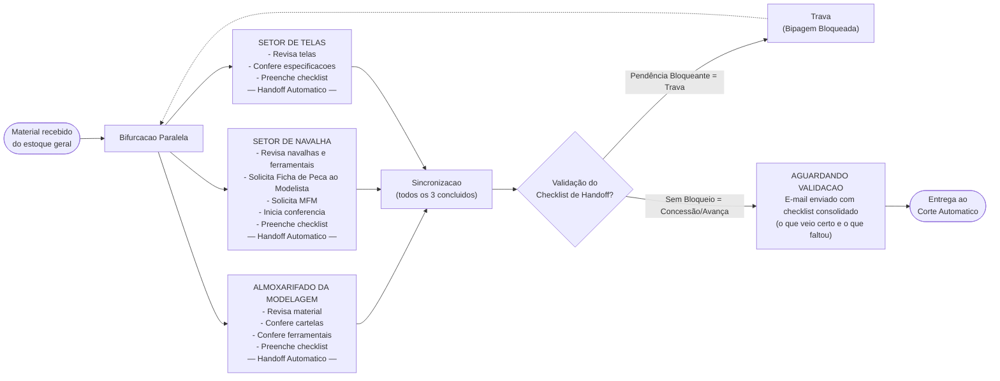

> [!NOTE]
> - O fluxo avança quando **todos os 3** setores tiverem checklist preenchido e bipagem de saída registrada.
> - **Não há Inspeção de Qualidade** nesta fase — Handoff Automático.
> - O e-mail consolidado é disparado pelo Genkit flow `dispararEmailChecklist` quando o último checklist é preenchido.

---

### 3.3 — Micro-fluxo: Corte Automático (v3.4 — Handoff Automático + Check Binário)

> v3.4: Recebimento, Separação e Dublagem usam **Handoff Automático** (sem Inspeção). A primeira inspeção obrigatória ocorre somente após o recolhimento pela Assistente de Modelagem. O Coordenador faz check OK/NÃO OK no Fechamento.

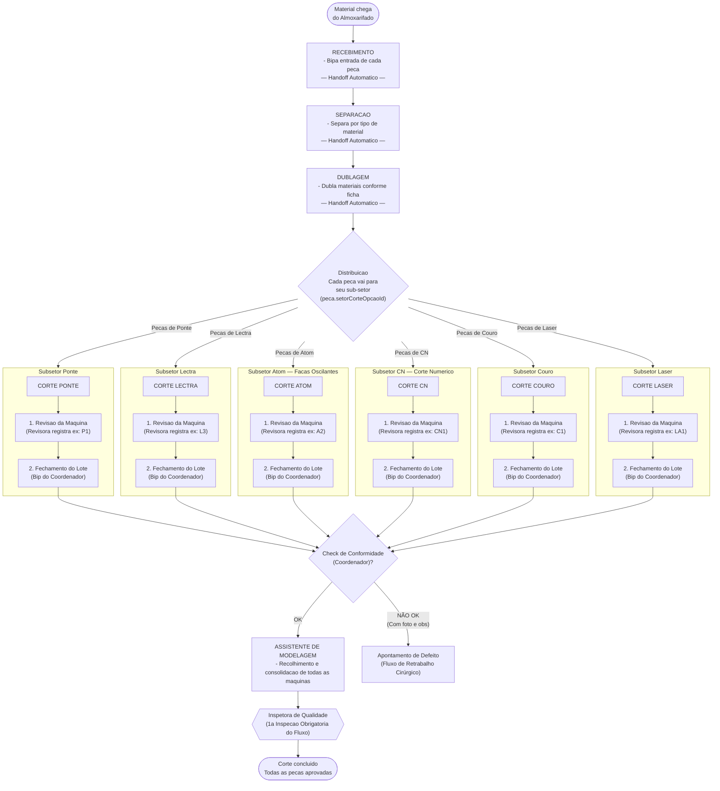

> [!NOTE]
> **Regras de Negócio (v3.4)**:
> - **Handoff Automático**: Recebimento, Separação e Dublagem avançam com simples bipagem de saída — sem inspeção.
> - **Distribuição automática**: o sistema consulta `peca.setorCorte` para determinar o destino de cada peça.
> - **Check Binário**: no `FECHAMENTO_LOTE`, o Coordenador registra `resultado_conformidade = OK | NAO_OK`. Se `NAO_OK`, `observacao` é obrigatória e fotos podem ser anexadas via `anexos` (`entidade_tipo = 'etapas_corte'`).
> - **1ª inspeção obrigatória**: somente após recolhimento pela Assistente de Modelagem, que agrupa todas as peças cortadas e entrega à Inspetora.

---

### 3.4 — Micro-fluxo: Setor de Apoio (v3.4 — com Laboratório Interno)

> v3.4: O Apoio ganha um **Teste de Laboratório obrigatório** após Fuse + Frequência, validando os processos de colagem/união antes do Recorte. A bipagem de saída do setor segue sendo **apenas no final**.

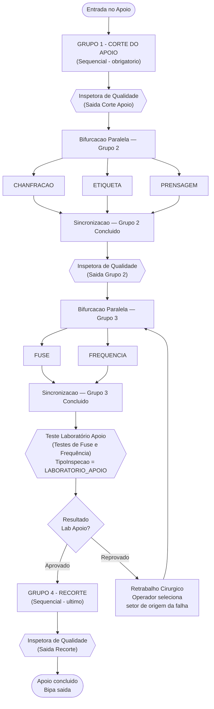

> [!NOTE]
> **Regras de sequência (v3.4)**:
> - Grupo 2 só inicia quando Grupo 1 está `CONCLUIDO` e aprovado pela Inspetora.
> - Grupo 3 só inicia quando **todas** as etapas do Grupo 2 estão concluídas e aprovadas.
> - **Laboratório do Apoio** (`LABORATORIO_APOIO`): obrigatório após Fuse + Frequência. Testa a qualidade da união das peças. Em caso de reprovação, o operador seleciona o setor de origem (Fuse ou Frequência) e o retrabalho é aberto naquele ponto específico.
> - Grupo 4 (Recorte) só inicia após o Laboratório do Apoio `APROVADO`.
> - Cada etapa gera um registro em `etapas_apoio`. O Lab do Apoio gera um registro em `inspecoes` com `tipoInspecao = LABORATORIO_APOIO`.

---

### 3.5 — Micro-fluxo: Fase Final (v3.4 — Reunião de Resultado)

> v3.4: Após o Laboratório Final, o lote entra em `AGUARDANDO_RESULTADO_FINAL`. Apenas o **Gerente de Modelagem** pode registrar o veredito após visualizar o Dossiê e o Dashboard.

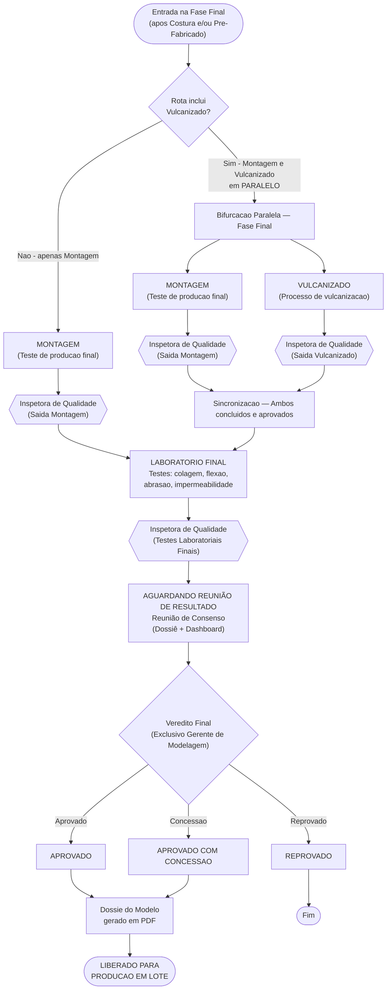

> [!IMPORTANT]
> **Vulcanizado como PARALELO**: Montagem e Vulcanizado compartilham a mesma `ordem` na `rota_modelo` com `tipoExecucao: PARALELO`. O sistema só avança para o Lab quando ambos tiverem inspeção `SAIDA_SETOR` aprovada.
>
> **Reunião de Resultado Final (v3.4)**: O status `AGUARDANDO_RESULTADO_FINAL` bloqueia qualquer avanço. O endpoint de registro de veredito verifica via RBAC que o usuário tem permissão `REGISTRAR_VEREDICTO_FINAL`, concedida exclusivamente ao perfil `GERENTE_MODELAGEM`. O campo `aprovacoes_finais.tipo = 'REUNIAO_CONSENSO'` diferencia este veredito de aprovações intermediárias.

---

### 3.6 — Diagrama: Bifurcação da Caixa Teste (Assincronismo)

> Quando `possuiCaixaTeste = true`, a ordem se **bifurca** em dois fluxos independentes que percorrem o **mesmo caminho de setores** mas em velocidades diferentes.

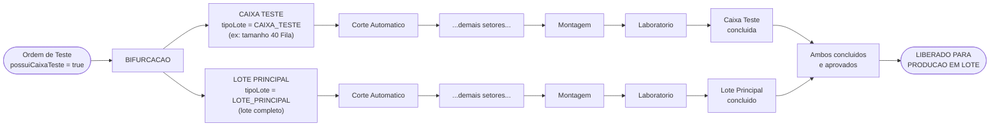

> [!CAUTION]
> **Regras da Caixa Teste**:
> - A CAIXA_TESTE pode estar na **Montagem** enquanto o LOTE_PRINCIPAL ainda está no **Corte Automático**. São fluxos independentes.
> - Cada lote tem seus próprios `Rastreamento` (com `tipoLote` diferente) e suas próprias `Inspecao` (com `tipoLote` diferente).
> - O `OrdemTeste.status` reflete o status do **LOTE_PRINCIPAL** (o mais atrasado).
> - A aprovação final (`LIBERADO_PRODUCAO`) só acontece quando **ambos** os lotes concluem o Laboratório com aprovação.
> - O Dashboard exibe uma **timeline dual** mostrando a posição de cada lote em tempo real.

---

## 4. Arquitetura de Fluxo Agêntico — Genkit 2.0

### 4.1 — Flow: `dispararEmailChecklist`

| Item | Detalhe |
|---|---|
| **Trigger** | Checklist preenchido (status → `PREENCHIDO` ou `COM_PENDENCIAS`) |
| **Input** | `checklistId`, `ordemTesteId` |
| **Ação** | Busca o checklist e seus itens (incluindo quaisquer itens avulsos inseridos em tempo real). O Genkit flow invoca o LLM para montar automaticamente uma tabela HTML visual e moderna, contendo colunas com ícones claros para indicar conformidade (✅) ou não conformidade (❌), o valor informado e a observação de cada item. O e-mail formatado é enviado automaticamente para a lista de distribuição (preenchedor, modelistas, assistentes e gerente de modelagem) sem necessidade de reintroduzir ou digitar dados manualmente. |
| **Nota** | Consolida o status dos 3 checklists paralelos (Almoxarifado, Navalha e Telas) na mesma tabela visual quando o último deles é preenchido, gerando um resumo consolidado do status inicial. |

### 4.2 — Flow: `analisarDivergencias`

| Item | Detalhe |
|---|---|
| **Trigger** | Nova divergência registrada OU sob demanda |
| **Input** | `ordemTesteId` ou `modeloId` |
| **Ação** | Coleta divergências → LLM identifica padrões recorrentes → Gera resumo executivo → Alerta se gravidade ALTA/CRITICA |

### 4.3 — Flow: `notificarMudancaStatus`

| Item | Detalhe |
|---|---|
| **Trigger** | Mudança de status em `OrdemTeste` |
| **Ação** | Determina destinatários → Envia e-mail + WebSocket → Se `LIBERADO_PRODUCAO`: atualiza `Modelo.status` |
| **Nota** | Se `possuiCaixaTeste`: notifica posição de ambos os lotes |

### 4.4 — Flow: `gerarResumoTesteDiario`

| Item | Detalhe |
|---|---|
| **Trigger** | Cron diário (fim do turno) ou sob demanda |
| **Ação** | Coleta métricas → LLM gera resumo → E-mail ao gerente |

### 4.5 — Flow: `sugerirRotaProducao`

| Item | Detalhe |
|---|---|
| **Trigger** | Cadastro de novo modelo |
| **Ação** | Analisa metadados do modelo → Sugere setores condicionais + posição dos flutuantes + `possuiCaixaTeste` → Pré-popula Construtor de Rota |

### 4.6 — Flow: `gerarInsightsQualidade`

| Item | Detalhe |
|---|---|
| **Trigger** | Cron diário/semanal OU sob demanda (Dashboard de Qualidade) |
| **Ação** | Coleta dados (SQL) → Monta Pareto → Monta Heatmap → LLM analisa → Salva em `insights_qualidade` → WebSocket atualiza Dashboard |

### 4.7 — Flow: `validarGateSaida`

| Item | Detalhe |
|---|---|
| **Trigger** | Operador tenta bipar saída de um setor (síncrono) |
| **Ação** | **Se o setor for Categoria A (Handoff Automático)**: Busca o checklist do setor. Se houver pendências (status = `COM_PENDENCIAS` ou itens não conformes): se `checklist.bloqueante = true`, bloqueia (retorna erro); se `checklist.bloqueante = false`, permite a bipagem mas dispara e-mail e WebSocket de concessão. <br>**Se o setor for Categoria B (Gate Obrigatório)**: Verifica existência de inspeção `SAIDA_SETOR` com resultado `APROVADO` ou `APROVADO_CONCESSAO` correspondente à ordem, setor e tipo de lote → Libera ou bloqueia bipagem. |

### 4.8 — Flow: `gerarDossieModelo`

> **Skill Invocada: @business-analyst** — Compila o relatório total do teste em PDF definitivo.

| Item | Detalhe |
|---|---|
| **Trigger** | `AprovacaoFinal.resultado` muda para `APROVADO` ou `APROVADO_CONCESSAO` no Laboratório |
| **Input** | `ordemTesteId` |
| **Passo 1** | Cria registro `dossies_modelo` com `status = GERANDO` → Notifica via WebSocket |
| **Passo 2** | Coleta em paralelo: `rastreamentos` (rota real + tempos), `checklists` (todas as fases), `ocorrencias_producao` + `anexos` (fotos), `inspecoes` + `inspecao_pecas`, `divergencias` + `retrabalhos`, `aprovacoes_finais` |
| **Passo 3** | LLM (`gemini-2.5-pro`) gera narrativa executiva resumida da trajetória do modelo |
| **Passo 4** | Renderiza PDF com biblioteca `puppeteer` (HTML → PDF) incorporando imagens dos `anexos` em linha |
| **Passo 5** | Salva PDF no filesystem → Atualiza `dossies_modelo.caminho_pdf` e `status = CONCLUIDO` |
| **Passo 6** | Notifica via WebSocket + envia e-mail ao Gerente e Modelista com link de download |
| **Retry** | Se falhar em qualquer passo, `status = ERRO` e o Gerente pode acionar nova geração via botão na UI |
| **Nota** | O PDF fica vinculado também via `anexos` (`entidade_tipo = 'dossies_modelo'`) para acesso unificado |

### Diagrama de Integração Genkit

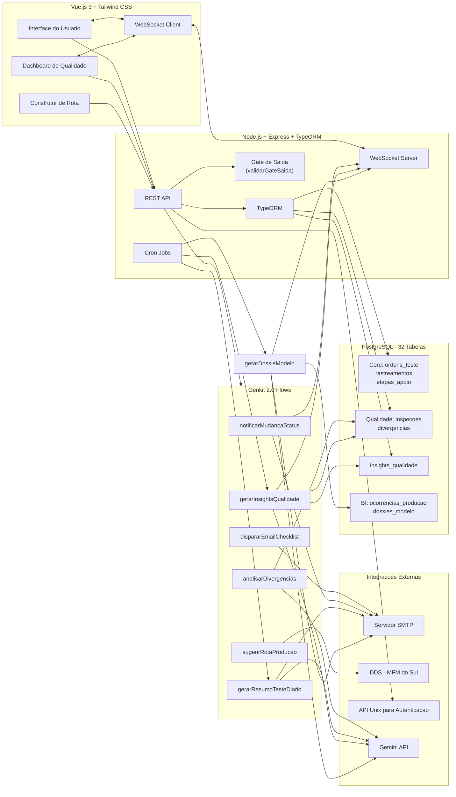

---

## 5. Construtor de Rota de Modelo — Especificação Frontend

> Tela para o **Modelista** definir a rota de produção de cada modelo via drag-and-drop.

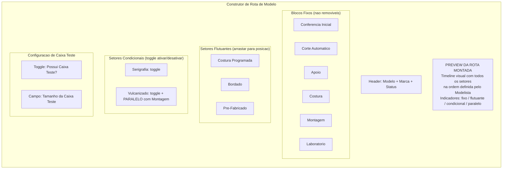

| Elemento | Comportamento |
|---|---|
| **Blocos Fixos** | Não removíveis. Conferência Inicial sempre em 1º, Laboratório sempre no final |
| **Costura Programada** | Drag-and-drop: (A) Dentro do Apoio (mesma `ordem`, `PARALELO`), (B) Junto da Costura, (C) Isolada pós-Apoio |
| **Bordado** | Drag-and-drop para qualquer posição entre Apoio e Montagem |
| **Pré-Fabricado** | Drag-and-drop para antes, junto ou depois da Montagem |
| **Serigrafia** | Toggle on/off — posição fixa após Corte |
| **Vulcanizado** | Toggle on/off — quando ativo, opera em **PARALELO** com Montagem (mesma `ordem`) |
| **Caixa Teste** | Toggle + campo de tamanho → define `possuiCaixaTeste` na OrdemTeste |
| **Preview** | Timeline atualizada em tempo real conforme drag/toggle |
| **Botão "IA Sugere"** | Chama Genkit flow `sugerirRotaProducao` e pré-popula a timeline |

---

## 6. Dashboard de Qualidade — Especificação de Telas

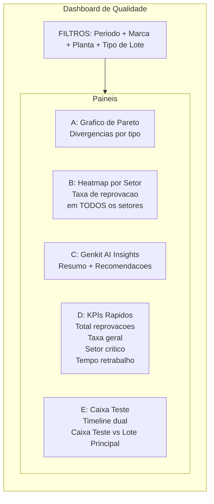

> [!NOTE]
> **Fontes de dados**:
> - **Painel A (Pareto)**: `divergencias` agrupadas por `tipo_divergencia`
> - **Painel B (Heatmap)**: `inspecoes` com `tipo_inspecao = SAIDA_SETOR` agrupadas por `setor_id` — agora cobre **todos os setores** (não apenas Corte) graças à Qualidade Onipresente
> - **Painel C**: `insights_qualidade` — último insight por planta
> - **Painel D**: Queries agregadas em `inspecao_pecas` + `retrabalhos`
> - **Painel E**: `rastreamentos` filtrados por `tipo_lote` — mostra posição de cada lote na timeline

---

## 6.1 Dashboard Gerencial de BI — Especificação dos 4 KPIs

> **Skill Invocada: @kpi-dashboard-design** — Define a arquitetura visual e as fontes de dados para o painel executivo da Gerência de Modelagem.

> [!IMPORTANT]
> **Audiência e Nível**: Dashboard **Tático/Gerencial** (Gerente + Supervisor de Setor). Atualização em tempo real via WebSocket. Segue a hierarquia: **Estratégico (North Star) → Tático (KPIs) → Operacional (Ocorrências em tempo real)**.

### KPI A — Lead Time do Teste

**Definição SMART**: Mede o tempo total (em horas) decorrido desde a entrada no Almoxarifado até a saída do Laboratório, separado por tipo de lote (CAIXA_TESTE vs LOTE_PRINCIPAL), descontando os tempos de SLA pausados por ocorrências impeditivas (`interrompeSla = true`).

> [!IMPORTANT]
> **Regra de Pausa de SLA (Lead Time & `tempoPermanenciaMin`)**:
> - Se houver ocorrência de produção no setor para aquela ordem com o flag `interrompeSla = true` (ex: falta de matéria-prima crítica, quebra total de máquina sem backup imediato):
> - O relógio de SLA é pausado: o sistema registra o tempo acumulado em que as ocorrências impeditivas estiveram com status `ABERTA` ou `EM_ANALISE` na tabela `ocorrencias_producao`.
> - Ao calcular a permanência no setor, o tempo de pausa (em minutos) é subtraído do tempo total decorrido.
> - O `tempoPermanenciaMin` gravado na tabela `rastreamentos` é: `(data_saida - data_entrada) - total_minutos_pausados`.
> - Isso evita penalizar os indicadores gerenciais e a eficiência operacional da fábrica por causas externas comprovadas.

```sql
-- SQL de referência para Lead Time ajustado com Pausa de SLA
SELECT
    ot.codigo_barras,
    r.tipo_lote,
    SUM(r.tempo_permanencia_min) / 60.0 AS lead_time_horas,
    ot.data_inicio,
    m.nome AS modelo,
    ma.nome AS marca
FROM rastreamentos r
JOIN ordens_teste ot ON ot.id = r.ordem_teste_id
JOIN modelos m ON m.id = ot.modelo_id
JOIN marcas ma ON ma.id = m.marca_id
WHERE ot.status IN ('LABORATORIO', 'APROVADO', 'LIBERADO_PRODUCAO')
GROUP BY ot.id, r.tipo_lote, m.nome, ma.nome, ot.codigo_barras, ot.data_inicio
ORDER BY ot.data_inicio DESC;
```

**Layout do Painel**:
```
┌─────────────────────────────────────────────────────────┐
│  LEAD TIME DO TESTE             [Periodo ▼] [Marca ▼]   │
├──────────────────────┬──────────────────────────────────┤
│  CAIXA TESTE         │  LOTE PRINCIPAL                  │
│  ⏱ 14h 23min        │  ⏱ 38h 10min                    │
│  (média últimas 5)   │  (média últimas 5)               │
├──────────────────────┴──────────────────────────────────┤
│  GRÁFICO DE LINHA: Lead Time por Ordem (últimas 10)     │
│  ─── Caixa Teste   ─── Lote Principal                   │
│       /\                /\                               │
│      /  \──────/\      /  \────────────────             │
│     /        /  \─────/                                 │
├─────────────────────────────────────────────────────────┤
│  Setor Gargalo: CORTE_ATOM  ⬆️ 6h avg  (acima da meta) │
└─────────────────────────────────────────────────────────┘
```

**Fonte de dados**: `rastreamentos.tempo_permanencia_min` agrupado por `ordem_teste_id` e `tipo_lote`.

---

### KPI B — Mapa de Gargalos em Tempo Real

**Definição SMART**: Lista visual das `ocorrencias_producao` abertas ou em análise, ordenadas por gravidade e data, com acesso rápido às fotos vinculadas.

```sql
-- SQL de referência para Mapa de Gargalos
SELECT
    op.id,
    op.titulo,
    op.tipo_ocorrencia,
    op.gravidade,
    op.status,
    op.data_ocorrencia,
    s.nome AS setor,
    u.nome_completo AS reportado_por,
    COUNT(a.id) AS total_fotos
FROM ocorrencias_producao op
JOIN setores s ON s.id = op.setor_id
JOIN usuarios u ON u.id = op.reportado_por_id
LEFT JOIN anexos a ON a.entidade_tipo = 'ocorrencias_producao'
    AND a.entidade_id = op.id
WHERE op.status IN ('ABERTA', 'EM_ANALISE')
GROUP BY op.id, s.nome, u.nome_completo
ORDER BY
    CASE op.gravidade
        WHEN 'CRITICA' THEN 1
        WHEN 'ALTA' THEN 2
        WHEN 'MEDIA' THEN 3
        WHEN 'BAIXA' THEN 4
    END,
    op.data_ocorrencia DESC;
```

**Layout do Painel**:
```
┌─────────────────────────────────────────────────────────┐
│  GARGALOS EM TEMPO REAL                  ● Live 10:42   │
├─────────────────────────────────────────────────────────┤
│  🔴 CRITICA │ Faca quebrada Ponte P1   │ CORTE_PONTE    │
│  Reportado: Maria S. │ 10:35 │ 📷 3 fotos │ [Ver Fotos] │
├─────────────────────────────────────────────────────────┤
│  🟠 ALTA    │ Falta de couro cabedal   │ SEPARACAO      │
│  Reportado: João M. │ 10:20 │ 📷 1 foto  │ [Ver Fotos]  │
├─────────────────────────────────────────────────────────┤
│  🟡 MEDIA   │ Lectra L3 lenta          │ CORTE_LECTRA   │
│  Reportado: Ana P.  │ 09:55 │ 📷 0 fotos │ [Ver]        │
├─────────────────────────────────────────────────────────┤
│  [Registrar Nova Ocorrência]  [Exportar]                │
└─────────────────────────────────────────────────────────┘
```

**Fonte de dados**: `ocorrencias_producao` (filtro `status IN ('ABERTA', 'EM_ANALISE')`) + JOIN `anexos` + WebSocket para atualizações em tempo real.

---

### KPI C — FPY (First Pass Yield) — Taxa de Aprovação de Primeira

**Definição SMART**: Percentual de rastreamentos (por setor ou global) que passaram pela Inspetora de Qualidade e foram **aprovados na primeira tentativa** (sem retrabalho).

```sql
-- SQL de referência para FPY
WITH inspecoes_por_setor AS (
    SELECT
        setor_id,
        COUNT(*) AS total_inspecoes,
        SUM(CASE WHEN resultado IN ('APROVADO', 'APROVADO_CONCESSAO') THEN 1 ELSE 0 END) AS aprovadas_primeira,
        SUM(CASE WHEN resultado = 'REPROVADO' THEN 1 ELSE 0 END) AS reprovadas
    FROM inspecoes
    WHERE tipo_inspecao = 'SAIDA_SETOR'
      AND data_inspecao >= NOW() - INTERVAL '30 days'
    GROUP BY setor_id
)
SELECT
    s.nome AS setor,
    ips.total_inspecoes,
    ips.aprovadas_primeira,
    ips.reprovadas,
    ROUND(
        (ips.aprovadas_primeira::NUMERIC / NULLIF(ips.total_inspecoes, 0)) * 100, 2
    ) AS fpy_percentual
FROM inspecoes_por_setor ips
JOIN setores s ON s.id = ips.setor_id
ORDER BY fpy_percentual ASC;
```

**Layout do Painel**:
```
┌─────────────────────────────────────────────────────────┐
│  FPY — FIRST PASS YIELD              [Últimos 30 dias]  │
├──────────────────┬──────────────────────────────────────┤
│  FPY GLOBAL      │  POR SETOR (Heatmap)                 │
│  ████████ 87.3%  │  APOIO          ██████████  94%      │
│  Meta: 90%       │  COSTURA        █████████   91%      │
│  ▼ 2.7% abaixo   │  MONTAGEM       ████████    88%      │
│                  │  CORTE_LECTRA   ██████      79%  ⚠️  │
│                  │  CORTE_ATOM     █████       74%  🔴  │
├──────────────────┴──────────────────────────────────────┤
│  Tendência (últimas 4 semanas):  ▲ Melhorando           │
│  Semana 1: 83% │ Semana 2: 85% │ Semana 3: 87% │ S4: -- │
└─────────────────────────────────────────────────────────┘
```

**Fonte de dados**: `inspecoes` (agrupadas por `setor_id` e `resultado`) + `rastreamentos` para calcular total de passagens.

---

### KPI D — Índice de Retrabalho por Setor

**Definição SMART**: Volume absoluto e percentual de retrabalhos por setor de origem, mostrando quais setores geram mais desvios recorrentes. Inclui tempo médio de retrabalho.

```sql
-- SQL de referência para Índice de Retrabalho
SELECT
    s.nome AS setor_origem,
    COUNT(rt.id) AS total_retrabalhos,
    ROUND(
        AVG(EXTRACT(EPOCH FROM (rt.data_fim - rt.data_inicio)) / 60), 0
    ) AS tempo_medio_min,
    STRING_AGG(DISTINCT d.tipo_divergencia, ', ') AS tipos_divergencia,
    ROUND(
        COUNT(rt.id)::NUMERIC / NULLIF(SUM(COUNT(rt.id)) OVER(), 0) * 100, 2
    ) AS percentual_do_total
FROM retrabalhos rt
JOIN setores s ON s.id = rt.setor_origem_id
JOIN divergencias d ON d.id = rt.divergencia_id
WHERE rt.created_at >= NOW() - INTERVAL '30 days'
GROUP BY s.id, s.nome
ORDER BY total_retrabalhos DESC
LIMIT 10;
```

**Layout do Painel**:
```
┌─────────────────────────────────────────────────────────┐
│  ÍNDICE DE RETRABALHO                [Últimos 30 dias]  │
├─────────────────────────────────────────────────────────┤
│  RANKING DE SETORES                                     │
│  1. CORTE_ATOM     ████████████████  18 casos  45min avg│
│  2. APOIO          ████████          11 casos  32min avg│
│  3. COSTURA        ██████            8 casos   28min avg│
│  4. MONTAGEM       ████              5 casos   55min avg│
│  5. CORTE_LECTRA   ███               4 casos   22min avg│
├─────────────────────────────────────────────────────────┤
│  Tipo de desvio mais frequente: DIMENSIONAL (38%)       │
│  [Ver Divergências] [Exportar Relatório]                │
└─────────────────────────────────────────────────────────┘
```

**Fonte de dados**: `retrabalhos` + JOIN `divergencias` + `setores` agrupados por `setor_origem_id`.

---

### Diagrama de Layout: Dashboard Gerencial de BI

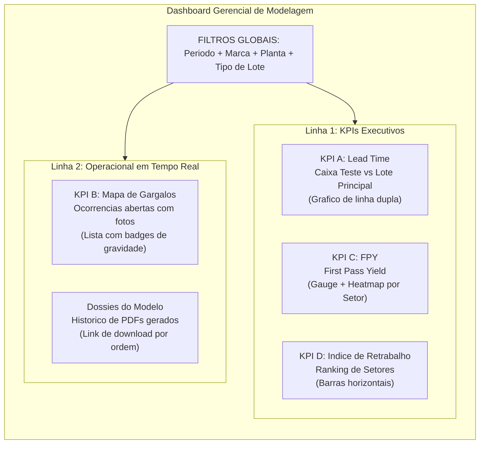

> [!NOTE]
> **Regras do Dashboard de BI**:
> - **Atualização**: Linha 1 (KPIs) atualiza a cada 5 minutos via polling. Linha 2 (Gargalos) em tempo real via WebSocket.
> - **Drill-down**: Clicar em qualquer setor no Heatmap FPY ou Ranking de Retrabalho abre modal com detalhe da ordem, da peça e do inspetor.
> - **Alertas automáticos**: FPY abaixo de 85% → notificação push + e-mail ao Gerente. Ocorrência `CRITICA` → alerta imediato via WebSocket.
> - **Exportação**: Todos os painéis suportam exportação CSV/PDF via botão contextual.
> - **Acesso**: Requer perfil `GERENTE` ou `SUPERVISOR_SETOR`. Adicionado ao `AcaoSetor.ADMINISTRAR_RBAC` do RBAC.

**Fontes de dados por KPI**:

| KPI | Tabelas Primárias | Filtros-chave |
|---|---|---|
| **A - Lead Time** | `rastreamentos`, `ordens_teste` | `tipo_lote`, `setor_id`, período |
| **B - Gargalos** | `ocorrencias_producao`, `anexos` | `status IN ('ABERTA','EM_ANALISE')` |
| **C - FPY** | `inspecoes`, `rastreamentos` | `tipo_inspecao = 'SAIDA_SETOR'`, `resultado` |
| **D - Retrabalho** | `retrabalhos`, `divergencias`, `setores` | `setor_origem_id`, período |

---

## 7. Painel Admin: Gestão de Usuários e Permissões (RBAC Dinâmico)

> Para evitar qualquer "hardcode" de regras de permissão no código-fonte, toda validação de ações por setor é baseada no cruzamento de dados da tabela `perfil_permissoes`.

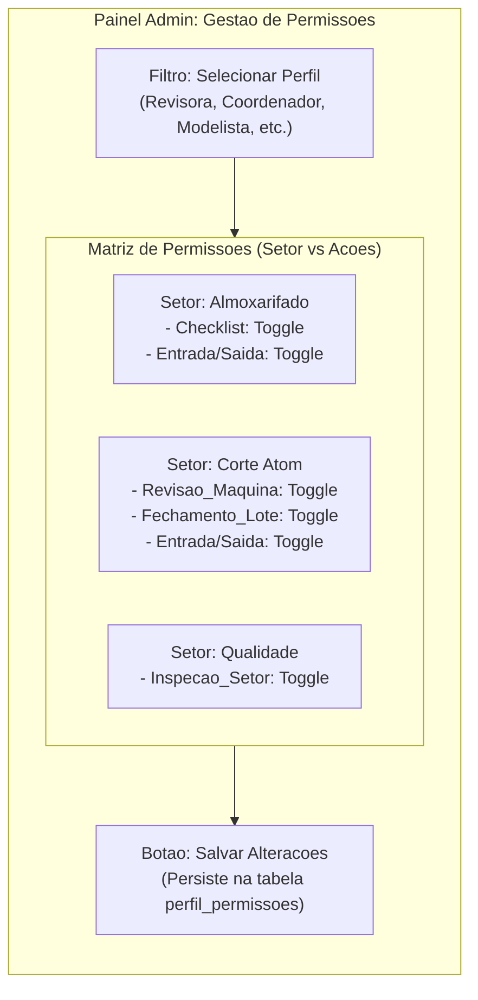

### Regras de Validação no Backend (Middleware Dinâmico)

Todo endpoint de bipagem, inspeção, preenchimento de checklist ou edição de rota passa por um middleware de autorização genérico `verificarPermissaoSetor(acao, obterSetorIdFromRequest?)`:

1. **Recupera Usuário**: Extrai o `perfilId` do token JWT do usuário logado.
2. **Identifica Contexto**:
   - `setorId`: Identifica o setor a partir do corpo da requisição, parâmetros da URL ou pelo `setorId` do próprio operador (se aplicável).
   - `acao`: Ex: `REVISAO_MAQUINA`, `FECHAMENTO_LOTE`, `INSPECIONAR_SETOR`.
3. **Consulta Banco**:
   - Executa uma busca em `perfil_permissoes` onde:
     ```sql
     SELECT permitido 
     FROM perfil_permissoes 
     WHERE perfil_id = :perfilId 
       AND (setor_id = :setorId OR setor_id IS NULL)
       AND acao = :acao
       AND permitido = true;
     ```
   - Se o registro não existir ou for `permitido = false`, o backend retorna HTTP `403 Forbidden` com uma mensagem amigável contendo o setor e a ação que foram negados.
4. **Seed de Inicialização (Padrão de Fábrica)**:
   - Na criação do banco de dados, o seed pré-configura as permissões padrão:
     - `Revisora` -> `REVISAO_MAQUINA` nos setores `CORTE_PONTE`, `CORTE_LECTRA`, `CORTE_ATOM`, `CORTE_CN`, `CORTE_COURO`.
     - `Coordenador do Setor` -> `FECHAMENTO_LOTE` nos subsetores de corte.
     - `Inspetora de Qualidade` -> `INSPECIONAR_SETOR` em todos os setores.
     - `Modelista` -> `EDITAR_ROTA` (global).
     - `Admin` -> `ADMINISTRAR_RBAC` (global).
   - Qualquer alteração posterior feita pelo Administrador na tela web substitui os padrões imediatamente sem necessidade de redeploy.

---

## 8. Contagem de Tabelas

| # | Tabela | Grupo | Status |
|---|---|---|---|
| 1 | `plantas` | Infraestrutura | ✅ |
| 2 | `setores` | Infraestrutura | ✅ |
| 3 | `estacoes_trabalho` | Infraestrutura | ✅ |
| 4 | `perfis` | Usuários | ✅ |
| 5 | `perfil_permissoes` | Usuários | ✅ |
| 6 | `usuarios` | Usuários | ✅ |
| 7 | `config_categorias` | Configuração | ✅ |
| 8 | `config_opcoes` | Configuração | ✅ |
| 9 | `marcas` | Produtos | ✅ |
| 10 | `modelos` | Produtos | ✅ |
| 11 | `pecas` | Produtos | ✅ |
| 12 | `rota_modelo` | Produtos | ✅ |
| 13 | `ordens_teste` | Produção | ✅ |
| 14 | `rastreamentos` | Produção | ✅ |
| 15 | `checklist_templates` | Checklists | ✅ |
| 16 | `checklist_template_itens` | Checklists | ✅ |
| 17 | `checklists` | Checklists | ✅ |
| 18 | `checklist_itens` | Checklists | ✅ |
| 19 | `inspecoes` | Qualidade | ✅ |
| 20 | `inspecao_pecas` | Qualidade | ✅ |
| 21 | `divergencias` | Qualidade | ✅ |
| 22 | `retrabalhos` | Qualidade | ✅ |
| 23 | `validacoes_setor` | Aprovações | ✅ |
| 24 | `aprovacoes_finais` | Aprovações | ✅ |
| 25 | `emails` | Notificações | ✅ |
| 26 | `anexos` | Sistema | ✅ |
| 27 | `audit_log` | Sistema | ✅ |
| 28 | `insights_qualidade` | Dashboard IA | ✅ |
| 29 | `etapas_apoio` | Micro-fluxo | ✅ |
| 30 | `etapas_corte` | Micro-fluxo | ✅ |
| 31 | `ocorrencias_producao` | BI Operacional | ✅ |
| 32 | `dossies_modelo` | BI Operacional | ✅ |

**Total: 32 tabelas**

---

## 9. Pontos de Atenção

> [!WARNING]
> ### Decisões pendentes
>
> 1. **Geração de código de barras**: Formato sugerido: `{MARCA}-{CODIGO}-{PECA}-{SEQ}`. Confirmar com PCP.
> 2. **Armazenamento de anexos**: Filesystem local com backup (volume baixo).
> 3. **WebSocket**: `socket.io` para dashboard, bipagem e bifurcação Caixa Teste.
> 4. **API do Unix para autenticação**: Confirmar contrato.
> 5. **Modelo Gemini para Genkit**: `gemini-2.0-flash` para diário; `gemini-2.5-pro` para sob demanda.
> 6. **Caixa Teste — código de barras**: Sugestão: `{MARCA}-{CODIGO}-CX-{SEQ}` vs `{MARCA}-{CODIGO}-LP-{SEQ}`.
> 7. **Performance do Gate de Qualidade**: Índice composto `(ordem_teste_id, setor_id, tipo_inspecao, tipo_lote)` é essencial.
> 8. **Drag-and-drop do Construtor de Rota**: Usar `vuedraggable` ou similar.

> [!IMPORTANT]
> ### Índices PostgreSQL recomendados
>
> - `rastreamentos(ordem_teste_id, setor_id, tipo_lote)` — posição atual por lote
> - `rastreamentos(data_entrada)` — consultas por período
> - `rastreamentos(inspecao_saida_id)` — vinculação com inspeção
> - `ordens_teste(status, planta_id)` — dashboard em tempo real
> - `ordens_teste(possui_caixa_teste)` — filtro de bifurcação
> - `inspecoes(ordem_teste_id, setor_id, tipo_inspecao, tipo_lote)` — Gate de Qualidade Onipresente
> - `inspecoes(resultado)` — KPIs do Dashboard
> - `inspecoes(data_inspecao, setor_id)` — FPY por período
> - `divergencias(ordem_teste_id, resolvido)` — divergências pendentes
> - `divergencias(tipo_divergencia, setor_id)` — Pareto + Heatmap
> - `retrabalhos(setor_origem_id, created_at)` — Índice de Retrabalho (KPI D)
> - `etapas_apoio(rastreamento_id, etapa)` — micro-fluxo do Apoio
> - `etapas_corte(rastreamento_id, etapa)` — micro-fluxo do Corte por Máquina
> - `perfil_permissoes(perfil_id, setor_id, acao)` — validação de segurança RBAC dinâmica
> - `checklists(ordem_teste_id, setor_id)` — verificação de bloqueio
> - `insights_qualidade(planta_id, gerado_em)` — último insight por planta
> - `rota_modelo(modelo_id, ordem)` — sequência de execução
> - `audit_log(entidade_tipo, entidade_id)` — histórico
> - `ocorrencias_producao(ordem_teste_id, status, gravidade)` — Mapa de Gargalos em Tempo Real (KPI B)
> - `ocorrencias_producao(setor_id, data_ocorrencia)` — análise por setor e período
> - `anexos(entidade_tipo, entidade_id)` — lookup polimórfico (fotos de ocorrências + dossiê)
> - `dossies_modelo(ordem_teste_id)` — unicidade do dossiê por ordem

---

## 10. Arquitetura de Segurança Enterprise — v4.0

> **Skill Invocada: @api-security-best-practices** — Define os padrões de autenticação, autorização, validação de entrada, rate limiting e proteção contra vulnerabilidades comuns de API (OWASP API Top 10).

> [!CAUTION]
> **Regra Inegociável**: Nenhuma rota da aplicação (exceto `/health`, `/api-docs` e `POST /api/auth/login`) pode ser acessada sem um JWT válido. Todas as variáveis sensíveis (segredos, senhas, chaves) devem estar em variáveis de ambiente — ZERO segredos no código-fonte.

---

### 10.1 — Cadeia de Middlewares Express (Ordem de Aplicação)

> [!IMPORTANT]
> A ordem dos middlewares é **crítica** para a segurança. A aplicação deve carregar os middlewares exatamente nesta sequência:

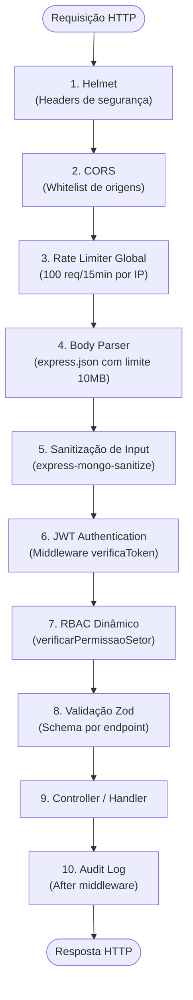

```typescript
// src/app.ts — Cadeia de Middlewares (produção)
import express from 'express';
import helmet from 'helmet';
import cors from 'cors';
import rateLimit from 'express-rate-limit';
import { verificaToken } from './middlewares/auth';
import { verificarPermissaoSetor } from './middlewares/rbac';
import { auditMiddleware } from './middlewares/audit';
import { corsOptions } from './config/cors';
import { globalLimiter, authLimiter, heavyLimiter } from './config/rateLimits';
import { swaggerSetup } from './config/swagger';

const app = express();

// ═══ CAMADA 1: SEGURANÇA DE TRANSPORTE ═══
app.use(helmet({
  contentSecurityPolicy: {
    directives: {
      defaultSrc: ["'self'"],
      styleSrc: ["'self'", "'unsafe-inline'"],  // Swagger UI precisa
      scriptSrc: ["'self'"],
      imgSrc: ["'self'", 'data:', 'https:'],
    },
  },
  frameguard: { action: 'deny' },         // Anti-clickjacking
  hidePoweredBy: true,                     // Oculta X-Powered-By
  noSniff: true,                           // Anti MIME-sniffing
  hsts: {
    maxAge: 31536000,                      // 1 ano
    includeSubDomains: true,
    preload: true,
  },
}));

// ═══ CAMADA 2: CORS (Whitelist de Origens) ═══
app.use(cors(corsOptions));

// ═══ CAMADA 3: RATE LIMITING GLOBAL ═══
app.use('/api/', globalLimiter);
app.use('/api/auth/login', authLimiter);
app.use('/api/auth/register', authLimiter);
app.use('/api/relatorios/', heavyLimiter);
app.use('/api/dossies/', heavyLimiter);

// ═══ CAMADA 4: BODY PARSER ═══
app.use(express.json({ limit: '10mb' }));
app.use(express.urlencoded({ extended: true, limit: '10mb' }));

// ═══ CAMADA 5: DOCUMENTAÇÃO (pública) ═══
swaggerSetup(app);

// ═══ CAMADA 6+: ROTAS (JWT + RBAC + Validação) ═══
// Rotas de autenticação (sem JWT)
app.use('/api/auth', authRoutes);

// Health check (sem JWT)
app.get('/health', (req, res) => res.json({ status: 'ok', timestamp: new Date() }));

// Todas as demais rotas: JWT obrigatório
app.use('/api', verificaToken, auditMiddleware, apiRoutes);

export default app;
```

---

### 10.2 — Autenticação JWT (Access + Refresh Tokens)

> [!IMPORTANT]
> **Integração com `dass_auth_service`**: O serviço de autenticação legado (`dass_auth_service`, porta 2399, rede `dass_private`) já implementa JWT com `jsonwebtoken`. O ERP de Modelagem **compartilha o mesmo `JWT_SECRET`** para validar tokens emitidos pelo `dass_auth_service`. Opcionalmente, o ERP pode emitir seus próprios tokens para operadores de chão de fábrica que não existem no sistema corporativo.

| Parâmetro | Valor | Justificativa |
|---|---|---|
| **Algoritmo** | `HS256` | Compatível com `dass_auth_service` |
| **Access Token TTL** | `1h` (3600s) | Sessão curta para operadores de chão de fábrica |
| **Refresh Token TTL** | `7d` | Semana útil sem re-login para supervisores |
| **Secret mínimo** | 256 bits (64 chars hex) | Gerado via `crypto.randomBytes(64).toString('hex')` |
| **Issuer** | `erp-modelagem` | Identificação do emissor |
| **Audience** | `erp-modelagem-users` | Identificação do público-alvo |

```typescript
// src/middlewares/auth.ts
import jwt from 'jsonwebtoken';
import { Request, Response, NextFunction } from 'express';

const JWT_SECRET = process.env.JWT_SECRET;
if (!JWT_SECRET) {
  throw new Error('FATAL: JWT_SECRET não definido nas variáveis de ambiente.');
}

export function verificaToken(req: Request, res: Response, next: NextFunction) {
  // Rotas públicas (já tratadas no app.ts, mas dupla-checagem)
  const publicPaths = ['/api/auth/login', '/api/auth/refresh', '/health'];
  if (publicPaths.includes(req.path)) return next();

  const authHeader = req.headers['authorization'];
  const token = authHeader && authHeader.split(' ')[1]; // Bearer TOKEN

  if (!token) {
    return res.status(401).json({
      error: 'Token de acesso obrigatório.',
      code: 'AUTH_TOKEN_REQUIRED',
    });
  }

  jwt.verify(token, JWT_SECRET, {
    issuer: 'erp-modelagem',
    audience: 'erp-modelagem-users',
  }, (err, decoded) => {
    if (err) {
      if (err.name === 'TokenExpiredError') {
        return res.status(401).json({
          error: 'Token expirado. Utilize o refresh token.',
          code: 'AUTH_TOKEN_EXPIRED',
        });
      }
      return res.status(403).json({
        error: 'Token inválido.',
        code: 'AUTH_TOKEN_INVALID',
      });
    }

    req.user = decoded as JwtPayload;
    next();
  });
}
```

**Payload JWT (claims)**:
```typescript
interface JwtPayload {
  userId: string;         // UUID do usuario
  perfilId: string;       // UUID do perfil (RBAC)
  perfilNome: string;     // Ex: 'REVISORA', 'COORDENADOR_SETOR'
  plantaId: string;       // UUID da planta de lotação
  setorId?: string;       // UUID do setor (opcional)
  nomeCompleto: string;   // Nome para exibição
  iss: string;            // 'erp-modelagem' ou 'dass-auth'
  aud: string;            // 'erp-modelagem-users'
  exp: number;            // Expiração
  iat: number;            // Emissão
}
```

**Fluxo de Refresh Token**:

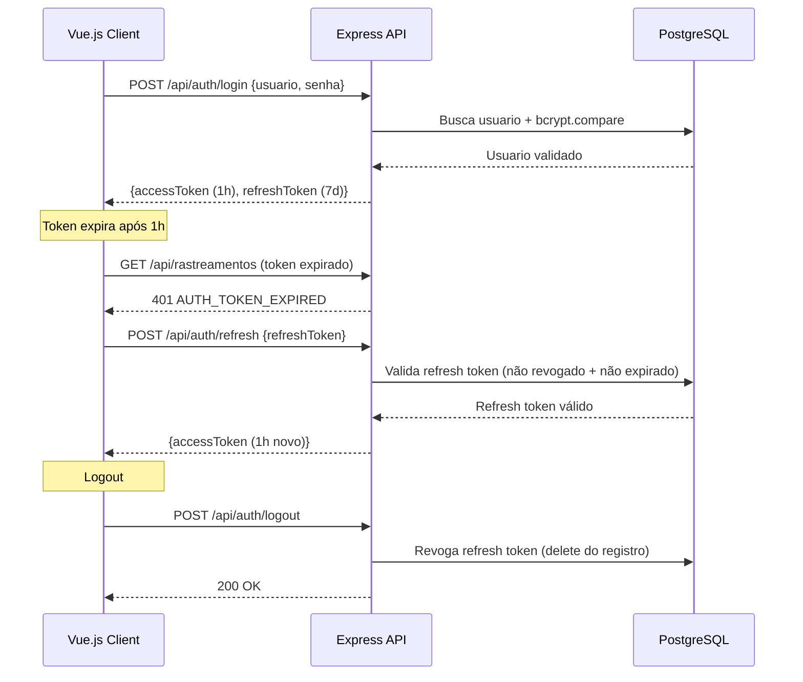

---

### 10.3 — CORS (Cross-Origin Resource Sharing)

> [!WARNING]
> **CORS com `credentials: true` exige origens explícitas** — é proibido usar `origin: '*'` com cookies/tokens. A whitelist deve ser mantida via variável de ambiente.

```typescript
// src/config/cors.ts
import { CorsOptions } from 'cors';

const ALLOWED_ORIGINS = (process.env.CORS_ALLOWED_ORIGINS || '')
  .split(',')
  .map(o => o.trim())
  .filter(Boolean);

// Fallback para desenvolvimento
if (ALLOWED_ORIGINS.length === 0) {
  ALLOWED_ORIGINS.push(
    'http://localhost:5173',     // Vite dev server (Vue.js)
    'http://localhost:3000',     // Alternativo
  );
}

export const corsOptions: CorsOptions = {
  origin: (origin, callback) => {
    // Permitir requisições sem origin (Postman, curl, health checks)
    if (!origin) return callback(null, true);

    if (ALLOWED_ORIGINS.includes(origin)) {
      callback(null, true);
    } else {
      callback(new Error(`Origem ${origin} não autorizada pela política de CORS.`));
    }
  },
  credentials: true,
  methods: ['GET', 'POST', 'PUT', 'PATCH', 'DELETE', 'OPTIONS'],
  allowedHeaders: ['Content-Type', 'Authorization', 'Accept', 'Cache-Control', 'X-Requested-With'],
  exposedHeaders: ['X-Total-Count', 'X-RateLimit-Limit', 'X-RateLimit-Remaining', 'X-RateLimit-Reset'],
  maxAge: 86400, // Preflight cache: 24h
};
```

**Origens esperadas por ambiente**:

| Ambiente | Origens |
|---|---|
| **Desenvolvimento** | `http://localhost:5173`, `http://localhost:3000` |
| **Homologação** | `http://10.100.1.43:5050`, `http://10.100.1.43:9137` |
| **Produção** | `http://10.100.1.43`, `http://10.110.21.53`, `http://10.110.21.53:3000` |

---

### 10.4 — Rate Limiting por Camada

> [!IMPORTANT]
> Três camadas de rate limiting protegem contra abuso e DDoS. Cada camada tem seu próprio limite, janela de tempo e key generator.

```typescript
// src/config/rateLimits.ts
import rateLimit from 'express-rate-limit';

// ═══ CAMADA GLOBAL ═══
// Protege todos os endpoints /api/*
export const globalLimiter = rateLimit({
  windowMs: 15 * 60 * 1000,       // 15 minutos
  max: 200,                        // 200 requisições por janela
  standardHeaders: true,           // RateLimit-* headers (RFC 6585)
  legacyHeaders: false,
  keyGenerator: (req) => req.user?.userId || req.ip || 'unknown',
  message: {
    error: 'Limite de requisições excedido. Tente novamente em 15 minutos.',
    code: 'RATE_LIMIT_EXCEEDED',
    retryAfter: 900,
  },
});

// ═══ CAMADA DE AUTENTICAÇÃO ═══
// Protege login e registro contra brute-force
export const authLimiter = rateLimit({
  windowMs: 15 * 60 * 1000,       // 15 minutos
  max: 5,                          // Apenas 5 tentativas de login
  skipSuccessfulRequests: true,    // Não conta logins bem-sucedidos
  message: {
    error: 'Muitas tentativas de login. Conta temporariamente bloqueada por 15 minutos.',
    code: 'AUTH_RATE_LIMIT',
    retryAfter: 900,
  },
});

// ═══ CAMADA DE OPERAÇÕES PESADAS ═══
// Protege geração de relatórios, dossiês e exports
export const heavyLimiter = rateLimit({
  windowMs: 60 * 60 * 1000,       // 1 hora
  max: 10,                         // 10 operações pesadas por hora
  message: {
    error: 'Limite de operações pesadas excedido. Tente novamente em 1 hora.',
    code: 'HEAVY_OP_RATE_LIMIT',
    retryAfter: 3600,
  },
});
```

---

### 10.5 — Validação de Entrada com Zod

> [!IMPORTANT]
> **Toda entrada da API** (body, params, query) é validada com Zod antes de chegar ao controller. Nenhum dado não-validado deve tocar o banco de dados.

```typescript
// src/middlewares/validate.ts
import { z, ZodSchema, ZodError } from 'zod';
import { Request, Response, NextFunction } from 'express';

export function validarRequest(schema: {
  body?: ZodSchema;
  params?: ZodSchema;
  query?: ZodSchema;
}) {
  return (req: Request, res: Response, next: NextFunction) => {
    try {
      if (schema.body) schema.body.parse(req.body);
      if (schema.params) schema.params.parse(req.params);
      if (schema.query) schema.query.parse(req.query);
      next();
    } catch (error) {
      if (error instanceof ZodError) {
        return res.status(400).json({
          error: 'Erro de validação nos dados enviados.',
          code: 'VALIDATION_ERROR',
          details: error.errors.map(e => ({
            campo: e.path.join('.'),
            mensagem: e.message,
          })),
        });
      }
      next(error);
    }
  };
}
```

**Exemplo de schema para bipagem**:
```typescript
// src/schemas/rastreamento.schema.ts
import { z } from 'zod';

export const bipagemEntradaSchema = {
  body: z.object({
    ordemTesteId: z.string().uuid('ID da ordem de teste inválido'),
    pecaId: z.string().uuid('ID da peça inválido').optional(),
    setorId: z.string().uuid('ID do setor inválido'),
    estacaoId: z.string().uuid('ID da estação inválido').optional(),
    tipoLote: z.enum(['LOTE_PRINCIPAL', 'CAIXA_TESTE'], {
      errorMap: () => ({ message: 'Tipo de lote deve ser LOTE_PRINCIPAL ou CAIXA_TESTE' }),
    }),
  }),
};

export const bipagemSaidaSchema = {
  params: z.object({
    rastreamentoId: z.string().uuid('ID do rastreamento inválido'),
  }),
};
```

---

### 10.6 — Proteção contra SQL Injection

> [!IMPORTANT]
> O uso do **TypeORM** com query builder parameterizado é **obrigatório**. É expressamente proibido concatenar strings em queries SQL.

| ❌ Proibido | ✅ Obrigatório |
|---|---|
| `` `SELECT * FROM usuarios WHERE id = '${userId}'` `` | `repository.findOne({ where: { id: userId } })` |
| `query("... WHERE nome LIKE '%" + nome + "%'")` | `queryBuilder.where('nome ILIKE :nome', { nome: `%${nome}%` })` |
| Template literals em `createQueryBuilder().where(...)` | Parâmetros nomeados `:param` em todas as queries |

```typescript
// ✅ CORRETO — TypeORM Query Builder com parâmetros
const rastreamentos = await rastreamentoRepository
  .createQueryBuilder('r')
  .innerJoinAndSelect('r.setor', 's')
  .where('r.ordemTesteId = :ordemId', { ordemId })
  .andWhere('r.tipoLote = :tipo', { tipo: TipoLote.CAIXA_TESTE })
  .andWhere('s.tipoOpcaoId = :tipoOpcaoId', { tipoOpcaoId })
  .orderBy('r.dataEntrada', 'DESC')
  .getMany();
```

---

### 10.7 — Tratamento de Erros Centralizado

> [!WARNING]
> Em produção, **nunca** expor stack traces, nomes de tabelas ou detalhes internos do banco de dados. Sanitizar todas as mensagens de erro.

```typescript
// src/middlewares/errorHandler.ts
import { Request, Response, NextFunction } from 'express';

export function errorHandler(err: Error, req: Request, res: Response, next: NextFunction) {
  // Log interno completo (Winston)
  console.error(`[ERROR] ${req.method} ${req.path}`, {
    message: err.message,
    stack: err.stack,
    userId: req.user?.userId,
    ip: req.ip,
  });

  // Resposta sanitizada para o cliente
  if (err.message?.includes('CORS')) {
    return res.status(403).json({
      error: 'Origem não autorizada.',
      code: 'CORS_REJECTED',
    });
  }

  // Erro de validação Zod (já tratado no middleware, mas safety net)
  if (err.name === 'ZodError') {
    return res.status(400).json({
      error: 'Dados de entrada inválidos.',
      code: 'VALIDATION_ERROR',
    });
  }

  // Erro genérico (sanitizado)
  return res.status(500).json({
    error: 'Erro interno do servidor. Contate o administrador.',
    code: 'INTERNAL_ERROR',
    // NÃO enviar: err.message, err.stack, nomes de tabelas
  });
}
```

---

### 10.8 — Checklist de Segurança (OWASP API Top 10)

| # | Vulnerabilidade OWASP | Mitigação Implementada | Status |
|---|---|---|---|
| API1 | Broken Object Level Authorization | RBAC dinâmico via `perfil_permissoes` + middleware `verificarPermissaoSetor` | ✅ |
| API2 | Broken Authentication | JWT + Refresh Tokens + bcrypt (salt rounds ≥ 10) + Rate Limit em `/auth` | ✅ |
| API3 | Broken Object Property Level Authorization | Schemas Zod com `select` explícito — nunca retornar `senhaHash`, `refreshToken` | ✅ |
| API4 | Unrestricted Resource Consumption | 3 camadas de Rate Limiting + `express.json({ limit: '10mb' })` | ✅ |
| API5 | Broken Function Level Authorization | RBAC verifica ação + setor em cada endpoint | ✅ |
| API6 | Unrestricted Access to Sensitive Business Flows | Gate de Qualidade + Handoff Automático com checklist | ✅ |
| API7 | Server Side Request Forgery (SSRF) | Validação de URLs de upload (whitelist de extensões) + sem proxy de URLs externas | ✅ |
| API8 | Security Misconfiguration | Helmet + HSTS + No X-Powered-By + CSP | ✅ |
| API9 | Improper Inventory Management | Swagger/OpenAPI documenta 100% dos endpoints + versionamento `/api/v1` | ✅ |
| API10 | Unsafe Consumption of APIs | Validação Zod na entrada de dados do `dass_auth_service` + timeout em axios | ✅ |

---

## 11. Infraestrutura Docker — v4.0

> **Skill Invocada: @docker-expert** — Define a estratégia de containerização, multi-stage build, orquestração e integração com serviços legados.

> [!IMPORTANT]
> **Contexto de Integração Legada**:
> - **`dass_auth_service`**: Node.js/Express (porta **2399**), PostgreSQL `sobracorte`, rede Docker `dass_private`, container `main-service`. Usa Sequelize + RabbitMQ + Redis.
> - **`sobracorte`**: Node.js/Express/TypeScript com Prisma (porta **3333**), mesmo PostgreSQL `sobracorte`, já implementa Helmet + Rate Limiting + CORS.
> - **Rede compartilhada**: `dass_private` (external: true) — permite comunicação inter-container sem exposição de portas ao host.

---

### 11.1 — Dockerfile (Multi-Stage Build Otimizado)

```dockerfile
# ════════════════════════════════════════════════════
# Dockerfile — ERP Chão de Fábrica (Testes de Produção)
# Multi-stage build otimizado para produção
# ════════════════════════════════════════════════════

# ═══ STAGE 1: Dependencies ═══
FROM node:20-alpine AS deps
WORKDIR /app
COPY package*.json ./
RUN npm ci --only=production && npm cache clean --force

# ═══ STAGE 2: Build ═══
FROM node:20-alpine AS build
WORKDIR /app
COPY package*.json ./
RUN npm ci
COPY tsconfig.json ./
COPY src/ ./src/
RUN npm run build && npm prune --production

# ═══ STAGE 3: Production Runtime ═══
FROM node:20-alpine AS runtime

# Segurança: usuário não-root
RUN addgroup -g 1001 -S erpgroup && \
    adduser -S erpuser -u 1001 -G erpgroup

WORKDIR /app

# Copiar apenas artefatos necessários
COPY --from=deps --chown=erpuser:erpgroup /app/node_modules ./node_modules
COPY --from=build --chown=erpuser:erpgroup /app/dist ./dist
COPY --from=build --chown=erpuser:erpgroup /app/package*.json ./

# Diretório para uploads de anexos (fotos de ocorrências, dossiês)
RUN mkdir -p /app/uploads && chown -R erpuser:erpgroup /app/uploads

# Trocar para usuário não-root
USER erpuser

# Porta da aplicação
EXPOSE 3001

# Health check
HEALTHCHECK --interval=30s --timeout=10s --start-period=15s --retries=3 \
  CMD wget --no-verbose --tries=1 --spider http://localhost:3001/health || exit 1

# Iniciar aplicação
CMD ["node", "dist/index.js"]
```

---

### 11.2 — Docker Compose (Orquestração Completa)

> [!IMPORTANT]
> O `docker-compose.yml` conecta o ERP de Modelagem à rede `dass_private` existente, permitindo comunicação direta com `dass_auth_service` (container `main-service`, porta 2399) e acesso ao PostgreSQL compartilhado.

```yaml
# docker-compose.yml — ERP Chão de Fábrica v4.0
# Orquestração com integração ao ecossistema DASS

services:
  # ═══════════════════════════════════════════
  # SERVIÇO PRINCIPAL: ERP de Modelagem
  # ═══════════════════════════════════════════
  erp-modelagem:
    build:
      context: .
      dockerfile: Dockerfile
      target: runtime
    container_name: erp-modelagem
    restart: unless-stopped
    ports:
      - "${ERP_PORT:-3001}:3001"
    environment:
      NODE_ENV: production
      # ── Database ──
      DB_HOST: ${DB_HOST:-host.docker.internal}
      DB_PORT: ${DB_PORT:-5432}
      DB_NAME: ${DB_NAME:-erp_modelagem}
      DB_USER: ${DB_USER:-postgres}
      DB_PASS: ${DB_PASS}
      # ── JWT (compartilhado com dass_auth_service) ──
      JWT_SECRET: ${JWT_SECRET}
      JWT_REFRESH_SECRET: ${JWT_REFRESH_SECRET}
      JWT_ACCESS_TTL: ${JWT_ACCESS_TTL:-3600}
      JWT_REFRESH_TTL: ${JWT_REFRESH_TTL:-604800}
      # ── Integração Legada ──
      DASS_AUTH_URL: http://main-service:2399
      SOBRACORTE_API_URL: ${SOBRACORTE_API_URL:-http://host.docker.internal:3333}
      # ── CORS ──
      CORS_ALLOWED_ORIGINS: ${CORS_ALLOWED_ORIGINS:-http://localhost:5173,http://localhost:3000}
      # ── SMTP (Genkit flows) ──
      SMTP_HOST: ${SMTP_HOST}
      SMTP_PORT: ${SMTP_PORT:-587}
      SMTP_USER: ${SMTP_USER}
      SMTP_PASS: ${SMTP_PASS}
      # ── Genkit / Gemini ──
      GOOGLE_GENAI_API_KEY: ${GOOGLE_GENAI_API_KEY}
      # ── Upload ──
      UPLOAD_DIR: /app/uploads
      UPLOAD_MAX_SIZE_MB: ${UPLOAD_MAX_SIZE_MB:-10}
    volumes:
      - erp_uploads:/app/uploads
    networks:
      - dass_private
      - erp_internal
    extra_hosts:
      - "host.docker.internal:host-gateway"
    depends_on:
      erp-postgres:
        condition: service_healthy
      erp-redis:
        condition: service_healthy
    deploy:
      resources:
        limits:
          cpus: "1.0"
          memory: 1G
        reservations:
          cpus: "0.5"
          memory: 512M
    healthcheck:
      test: ["CMD", "wget", "--no-verbose", "--tries=1", "--spider", "http://localhost:3001/health"]
      interval: 30s
      timeout: 10s
      retries: 3
      start_period: 15s

  # ═══════════════════════════════════════════
  # BANCO DE DADOS: PostgreSQL dedicado
  # ═══════════════════════════════════════════
  erp-postgres:
    image: postgres:16-alpine
    container_name: erp-postgres
    restart: unless-stopped
    environment:
      POSTGRES_DB: ${DB_NAME:-erp_modelagem}
      POSTGRES_USER: ${DB_USER:-postgres}
      POSTGRES_PASSWORD: ${DB_PASS}
    ports:
      - "${DB_EXTERNAL_PORT:-5433}:5432"
    volumes:
      - erp_pgdata:/var/lib/postgresql/data
    networks:
      - erp_internal
    healthcheck:
      test: ["CMD-SHELL", "pg_isready -U ${DB_USER:-postgres} -d ${DB_NAME:-erp_modelagem}"]
      interval: 10s
      timeout: 5s
      retries: 5
      start_period: 30s
    deploy:
      resources:
        limits:
          cpus: "0.5"
          memory: 512M
        reservations:
          cpus: "0.25"
          memory: 256M

  # ═══════════════════════════════════════════
  # CACHE: Redis (Rate Limiting + WebSocket)
  # ═══════════════════════════════════════════
  erp-redis:
    image: redis:7-alpine
    container_name: erp-redis
    restart: unless-stopped
    command: redis-server --requirepass ${REDIS_PASS:-erp_redis_secret} --maxmemory 128mb --maxmemory-policy allkeys-lru
    ports:
      - "${REDIS_EXTERNAL_PORT:-6380}:6379"
    volumes:
      - erp_redisdata:/data
    networks:
      - erp_internal
    healthcheck:
      test: ["CMD", "redis-cli", "-a", "${REDIS_PASS:-erp_redis_secret}", "ping"]
      interval: 10s
      timeout: 5s
      retries: 5
    deploy:
      resources:
        limits:
          cpus: "0.25"
          memory: 128M

# ═══════════════════════════════════════════
# VOLUMES PERSISTENTES
# ═══════════════════════════════════════════
volumes:
  erp_pgdata:
    driver: local
  erp_redisdata:
    driver: local
  erp_uploads:
    driver: local

# ═══════════════════════════════════════════
# REDES
# ═══════════════════════════════════════════
networks:
  # Rede compartilhada com dass_auth_service (external)
  dass_private:
    external: true

  # Rede interna do ERP (isolada)
  erp_internal:
    driver: bridge
    internal: true
```

---

### 11.3 — Docker Compose Override (Desenvolvimento)

```yaml
# docker-compose.override.yml — Ambiente de desenvolvimento
# Ativado automaticamente pelo Docker Compose

services:
  erp-modelagem:
    build:
      target: build    # Usa estágio com devDependencies
    volumes:
      - ./src:/app/src                   # Hot reload
      - ./uploads:/app/uploads           # Uploads locais
      - /app/node_modules                # Excluir node_modules do bind mount
    environment:
      NODE_ENV: development
      DB_HOST: erp-postgres
      DB_PORT: 5432
      CORS_ALLOWED_ORIGINS: "http://localhost:5173,http://localhost:3000"
    ports:
      - "3001:3001"
      - "9229:9229"     # Node.js debug port
    command: npm run dev

  erp-postgres:
    ports:
      - "5433:5432"     # Acesso externo para ferramentas (DBeaver, pgAdmin)
```

---

### 11.4 — Diagrama de Rede Docker

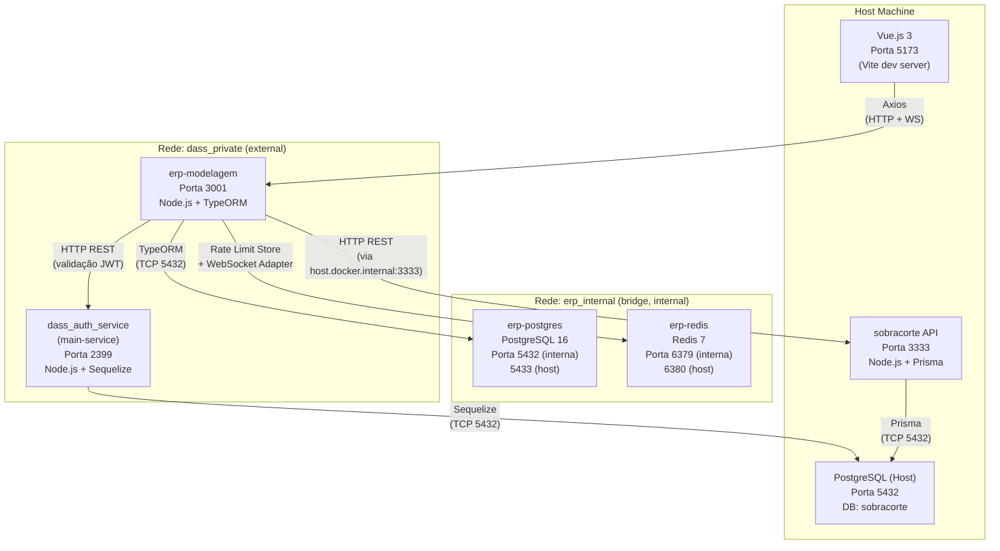

---

### 11.5 — Variáveis de Ambiente (.env.example)

> [!CAUTION]
> **O arquivo `.env` NUNCA deve ser commitado no Git.** Adicione-o ao `.gitignore`. O `.env.example` serve apenas como documentação.

```bash
# ════════════════════════════════════════════════════
# .env.example — ERP Chão de Fábrica v4.0
# Copie para .env e preencha os valores
# ════════════════════════════════════════════════════

# ── Aplicação ──
NODE_ENV=production
ERP_PORT=3001

# ── Banco de Dados (PostgreSQL dedicado do ERP) ──
DB_HOST=erp-postgres
DB_PORT=5432
DB_NAME=erp_modelagem
DB_USER=postgres
DB_PASS=ALTERAR_PARA_SENHA_FORTE_AQUI
DB_EXTERNAL_PORT=5433

# ── JWT (DEVE ser o mesmo do dass_auth_service para SSO) ──
JWT_SECRET=GERAR_COM_crypto_randomBytes_64_toString_hex
JWT_REFRESH_SECRET=GERAR_COM_crypto_randomBytes_64_toString_hex_DIFERENTE
JWT_ACCESS_TTL=3600
JWT_REFRESH_TTL=604800

# ── Integração Legada ──
DASS_AUTH_URL=http://main-service:2399
SOBRACORTE_API_URL=http://host.docker.internal:3333

# ── CORS (separar origens por vírgula) ──
CORS_ALLOWED_ORIGINS=http://localhost:5173,http://10.100.1.43

# ── Redis (Rate Limiting + WebSocket) ──
REDIS_HOST=erp-redis
REDIS_PORT=6379
REDIS_PASS=ALTERAR_PARA_SENHA_FORTE_REDIS
REDIS_EXTERNAL_PORT=6380

# ── SMTP (E-mails de Checklist, Notificações, Dossiê) ──
SMTP_HOST=smtp.seudominio.com
SMTP_PORT=587
SMTP_USER=erp@seudominio.com
SMTP_PASS=SENHA_SMTP

# ── Genkit / Gemini AI ──
GOOGLE_GENAI_API_KEY=AIza...

# ── Upload de Anexos (Fotos de ocorrências, dossiês) ──
UPLOAD_DIR=/app/uploads
UPLOAD_MAX_SIZE_MB=10
```

**Validação obrigatória no startup**:
```typescript
// src/config/env.ts
const REQUIRED_VARS = [
  'JWT_SECRET',
  'JWT_REFRESH_SECRET',
  'DB_PASS',
  'DB_NAME',
  'DB_HOST',
] as const;

for (const varName of REQUIRED_VARS) {
  if (!process.env[varName]) {
    throw new Error(
      `FATAL: Variável de ambiente obrigatória "${varName}" não definida. ` +
      `Consulte o arquivo .env.example para documentação.`
    );
  }
}
```

---

### 11.6 — .dockerignore

```
node_modules
npm-debug.log
dist
.git
.gitignore
.env
.env.prod
*.md
docker-compose*.yml
Dockerfile
.dockerignore
uploads
coverage
.vscode
.idea
```

---

## 12. Documentação API — Swagger/OpenAPI 3.0 — v4.0

> **Skill Invocada: @api-documentation** — Define a estratégia de documentação interativa com Swagger UI, schemas e Postman Collection.

> [!IMPORTANT]
> **Rota da documentação**: `GET /api-docs` — Acessível sem autenticação. Swagger UI renderiza a especificação OpenAPI 3.0 com try-it-out habilitado (requer token JWT para endpoints protegidos).

---

### 12.1 — Configuração Swagger/OpenAPI

```typescript
// src/config/swagger.ts
import swaggerJsdoc from 'swagger-jsdoc';
import swaggerUi from 'swagger-ui-express';
import { Express } from 'express';

const swaggerOptions: swaggerJsdoc.Options = {
  definition: {
    openapi: '3.0.3',
    info: {
      title: 'ERP Chão de Fábrica — API de Testes de Produção',
      version: '4.0.0',
      description: `
API REST para rastreamento de testes de produção calçadista.

**Funcionalidades Principais:**
- Rastreamento de bipagem por peça/setor
- Gestão de Ordens de Teste com Caixa Teste e Lote Principal
- Checklists dinâmicos com itens avulsos
- Inspeção de Qualidade seletiva (Handoff Automático + Gate Obrigatório)
- Micro-fluxo de Corte Automático com dupla bipagem
- Micro-fluxo de Apoio com Lab interno
- Dashboard Gerencial de BI (4 KPIs)
- Ocorrências com upload de fotos
- Dossiê do Modelo (PDF via Genkit)
- RBAC Dinâmico "Zero Hardcode"
      `,
      contact: {
        name: 'Equipe de Desenvolvimento — Modelagem',
        email: 'dev.modelagem@empresa.com',
      },
    },
    servers: [
      {
        url: 'http://localhost:3001/api',
        description: 'Desenvolvimento',
      },
      {
        url: 'http://10.100.1.43:3001/api',
        description: 'Homologação',
      },
    ],
    components: {
      securitySchemes: {
        bearerAuth: {
          type: 'http',
          scheme: 'bearer',
          bearerFormat: 'JWT',
          description: 'Token JWT obtido via POST /api/auth/login',
        },
      },
      schemas: {
        // Schemas reutilizáveis (exemplos)
        Error: {
          type: 'object',
          properties: {
            error: { type: 'string', example: 'Descrição do erro' },
            code: { type: 'string', example: 'ERROR_CODE' },
            details: {
              type: 'array',
              items: {
                type: 'object',
                properties: {
                  campo: { type: 'string' },
                  mensagem: { type: 'string' },
                },
              },
            },
          },
        },
        Pagination: {
          type: 'object',
          properties: {
            page: { type: 'integer', example: 1 },
            limit: { type: 'integer', example: 20 },
            total: { type: 'integer', example: 150 },
            totalPages: { type: 'integer', example: 8 },
          },
        },
      },
    },
    security: [{ bearerAuth: [] }],
    tags: [
      { name: 'Auth', description: 'Autenticação e tokens' },
      { name: 'Ordens de Teste', description: 'CRUD de ordens de teste' },
      { name: 'Rastreamentos', description: 'Bipagem e movimentação' },
      { name: 'Checklists', description: 'Templates e preenchimento' },
      { name: 'Inspeções', description: 'Qualidade e laboratório' },
      { name: 'Corte', description: 'Micro-fluxo de corte por máquina' },
      { name: 'Apoio', description: 'Micro-fluxo do setor de apoio' },
      { name: 'Ocorrências', description: 'Gargalos e problemas' },
      { name: 'Dossiê', description: 'Relatório final em PDF' },
      { name: 'Dashboard', description: 'KPIs e BI gerencial' },
      { name: 'Admin', description: 'Gestão de usuários e RBAC' },
      { name: 'Configurações', description: 'Config dinâmicas e opções' },
    ],
  },
  // Onde ficam as anotações JSDoc nos arquivos de rota
  apis: ['./src/routes/**/*.ts', './src/schemas/**/*.ts'],
};

const swaggerSpec = swaggerJsdoc(swaggerOptions);

export function swaggerSetup(app: Express) {
  app.use('/api-docs', swaggerUi.serve, swaggerUi.setup(swaggerSpec, {
    customCss: '.swagger-ui .topbar { display: none }',
    customSiteTitle: 'ERP Modelagem — API Docs',
    swaggerOptions: {
      persistAuthorization: true,
      tryItOutEnabled: true,
    },
  }));

  // Endpoint JSON da spec (para Postman import)
  app.get('/api-docs.json', (req, res) => {
    res.setHeader('Content-Type', 'application/json');
    res.send(swaggerSpec);
  });
}
```

---

### 12.2 — Exemplo de Anotação de Rota (JSDoc → OpenAPI)

```typescript
// src/routes/rastreamento.routes.ts

/**
 * @openapi
 * /rastreamentos/bipar-entrada:
 *   post:
 *     tags: [Rastreamentos]
 *     summary: Registra bipagem de entrada de peça/lote em um setor
 *     description: |
 *       Cria um novo rastreamento com `dataEntrada = NOW()`.
 *       Valida permissão RBAC (`BIPAR_ENTRADA`) para o setor.
 *       Se o setor usa Handoff Automático, valida checklist.
 *     security:
 *       - bearerAuth: []
 *     requestBody:
 *       required: true
 *       content:
 *         application/json:
 *           schema:
 *             type: object
 *             required:
 *               - ordemTesteId
 *               - setorId
 *               - tipoLote
 *             properties:
 *               ordemTesteId:
 *                 type: string
 *                 format: uuid
 *                 example: "550e8400-e29b-41d4-a716-446655440000"
 *               pecaId:
 *                 type: string
 *                 format: uuid
 *                 nullable: true
 *               setorId:
 *                 type: string
 *                 format: uuid
 *               estacaoId:
 *                 type: string
 *                 format: uuid
 *                 nullable: true
 *               tipoLote:
 *                 type: string
 *                 enum: [LOTE_PRINCIPAL, CAIXA_TESTE]
 *     responses:
 *       201:
 *         description: Bipagem registrada com sucesso
 *         content:
 *           application/json:
 *             schema:
 *               type: object
 *               properties:
 *                 id:
 *                   type: string
 *                   format: uuid
 *                 dataEntrada:
 *                   type: string
 *                   format: date-time
 *                 status:
 *                   type: string
 *                   example: EM_PROCESSO
 *       400:
 *         description: Erro de validação
 *         content:
 *           application/json:
 *             schema:
 *               $ref: '#/components/schemas/Error'
 *       401:
 *         description: Token JWT ausente ou expirado
 *       403:
 *         description: Permissão RBAC negada para este setor/ação
 */
router.post('/bipar-entrada',
  validarRequest(bipagemEntradaSchema),
  verificarPermissaoSetor('BIPAR_ENTRADA'),
  rastreamentoController.biparEntrada,
);
```

---

### 12.3 — Mapa Completo de Endpoints da API

> [!NOTE]
> Esta tabela documenta todos os endpoints planejados, organizados por tag/módulo. Cada endpoint lista o método HTTP, a rota, a ação RBAC necessária e o middleware de rate limiting aplicado.

| Tag | Método | Rota | Ação RBAC | Rate Limit | Descrição |
|---|---|---|---|---|---|
| **Auth** | `POST` | `/auth/login` | — | `authLimiter` | Login com usuário/senha → JWT |
| **Auth** | `POST` | `/auth/refresh` | — | `authLimiter` | Refresh token → novo access token |
| **Auth** | `POST` | `/auth/logout` | — | `globalLimiter` | Revoga refresh token |
| **Ordens** | `POST` | `/ordens-teste` | `EDITAR_ROTA` | `globalLimiter` | Criar ordem de teste |
| **Ordens** | `GET` | `/ordens-teste` | `BIPAR_ENTRADA` | `globalLimiter` | Listar ordens (com filtros) |
| **Ordens** | `GET` | `/ordens-teste/:id` | `BIPAR_ENTRADA` | `globalLimiter` | Detalhe de uma ordem |
| **Rastreamentos** | `POST` | `/rastreamentos/bipar-entrada` | `BIPAR_ENTRADA` | `globalLimiter` | Bipagem de entrada |
| **Rastreamentos** | `POST` | `/rastreamentos/:id/bipar-saida` | `BIPAR_SAIDA` | `globalLimiter` | Bipagem de saída (com validação gate/handoff) |
| **Corte** | `POST` | `/etapas-corte/revisao-maquina` | `REVISAO_MAQUINA` | `globalLimiter` | 1º bip (Revisora) |
| **Corte** | `POST` | `/etapas-corte/fechamento-lote` | `FECHAMENTO_LOTE` | `globalLimiter` | 2º bip (Coordenador) + conformidade |
| **Checklists** | `POST` | `/checklists` | `PREENCHER_CHECKLIST` | `globalLimiter` | Criar/preencher checklist |
| **Checklists** | `POST` | `/checklists/:id/itens-avulsos` | `PREENCHER_CHECKLIST` | `globalLimiter` | Adicionar item avulso |
| **Inspeções** | `POST` | `/inspecoes` | `INSPECIONAR_SETOR` | `globalLimiter` | Registrar inspeção |
| **Ocorrências** | `POST` | `/ocorrencias` | `BIPAR_ENTRADA` | `globalLimiter` | Registrar ocorrência |
| **Ocorrências** | `POST` | `/ocorrencias/:id/anexos` | `BIPAR_ENTRADA` | `globalLimiter` | Upload de foto (multipart) |
| **Dossiê** | `POST` | `/dossies/:ordemTesteId/gerar` | `REGISTRAR_VEREDICTO_FINAL` | `heavyLimiter` | Disparar geração do PDF |
| **Dossiê** | `GET` | `/dossies/:id/download` | `BIPAR_ENTRADA` | `heavyLimiter` | Download do PDF |
| **Dashboard** | `GET` | `/dashboard/lead-time` | `BIPAR_ENTRADA` | `globalLimiter` | KPI A — Lead Time |
| **Dashboard** | `GET` | `/dashboard/gargalos` | `BIPAR_ENTRADA` | `globalLimiter` | KPI B — Mapa de Gargalos |
| **Dashboard** | `GET` | `/dashboard/fpy` | `BIPAR_ENTRADA` | `globalLimiter` | KPI C — First Pass Yield |
| **Dashboard** | `GET` | `/dashboard/retrabalho` | `BIPAR_ENTRADA` | `globalLimiter` | KPI D — Índice de Retrabalho |
| **Admin** | `GET` | `/admin/usuarios` | `ADMINISTRAR_RBAC` | `globalLimiter` | Listar usuários |
| **Admin** | `POST` | `/admin/usuarios` | `ADMINISTRAR_RBAC` | `globalLimiter` | Criar usuário |
| **Admin** | `PUT` | `/admin/permissoes` | `ADMINISTRAR_RBAC` | `globalLimiter` | Alterar permissões RBAC |
| **Admin** | `GET` | `/admin/permissoes/:perfilId` | `ADMINISTRAR_RBAC` | `globalLimiter` | Obter matriz de permissões |
| **Config** | `GET` | `/config/opcoes/:categoriaSlug` | `BIPAR_ENTRADA` | `globalLimiter` | Listar opções por categoria |
| **Config** | `POST` | `/config/opcoes` | `ADMINISTRAR_RBAC` | `globalLimiter` | Criar opção dinâmica |
| **Aprovações** | `POST` | `/aprovacoes/veredicto-final` | `REGISTRAR_VEREDICTO_FINAL` | `globalLimiter` | Reunião de Consenso |
| **Rota** | `GET` | `/rotas/:modeloId` | `EDITAR_ROTA` | `globalLimiter` | Obter rota de modelo |
| **Rota** | `PUT` | `/rotas/:modeloId` | `EDITAR_ROTA` | `globalLimiter` | Salvar rota (Construtor) |

---

### 12.4 — Postman Collection

> [!TIP]
> A Postman Collection é gerada automaticamente a partir do endpoint `/api-docs.json` e pode ser importada no Postman via:
> `Import → Link → http://localhost:3001/api-docs.json`

**Estrutura da Collection**:
```
📁 ERP Modelagem — v4.0
├── 📁 Auth
│   ├── POST Login
│   ├── POST Refresh Token
│   └── POST Logout
├── 📁 Ordens de Teste
│   ├── POST Criar Ordem
│   ├── GET Listar Ordens
│   └── GET Detalhe Ordem
├── 📁 Rastreamentos
│   ├── POST Bipar Entrada
│   └── POST Bipar Saída
├── 📁 Corte Automático
│   ├── POST Revisão Máquina
│   └── POST Fechamento Lote
├── 📁 Checklists
│   ├── POST Preencher Checklist
│   └── POST Item Avulso
├── 📁 Inspeções
│   └── POST Registrar Inspeção
├── 📁 Ocorrências
│   ├── POST Registrar Ocorrência
│   └── POST Upload Foto
├── 📁 Dossiê
│   ├── POST Gerar PDF
│   └── GET Download PDF
├── 📁 Dashboard BI
│   ├── GET Lead Time
│   ├── GET Gargalos
│   ├── GET FPY
│   └── GET Retrabalho
├── 📁 Admin (RBAC)
│   ├── GET Listar Usuários
│   ├── POST Criar Usuário
│   ├── GET Permissões por Perfil
│   └── PUT Alterar Permissões
├── 📁 Configurações
│   ├── GET Opções por Categoria
│   └── POST Criar Opção
├── 📁 Aprovações
│   └── POST Veredito Final
└── 📁 Rota do Modelo
    ├── GET Obter Rota
    └── PUT Salvar Rota
```

**Variáveis de ambiente Postman**:

| Variável | Valor (Dev) | Descrição |
|---|---|---|
| `{{baseUrl}}` | `http://localhost:3001/api` | URL base da API |
| `{{authToken}}` | *(auto-preenchido pelo script de login)* | JWT Access Token |
| `{{refreshToken}}` | *(auto-preenchido pelo script de login)* | JWT Refresh Token |

**Script de auto-autenticação** (pré-request no Login):
```javascript
// Postman Pre-request Script para todas as requisições
const loginResponse = pm.response;
if (loginResponse) {
  const json = loginResponse.json();
  pm.environment.set('authToken', json.token);
  pm.environment.set('refreshToken', json.refreshToken);
}
```

---

### 12.5 — Diagrama de Integração Completo (v4.0 — Segurança + Infra)

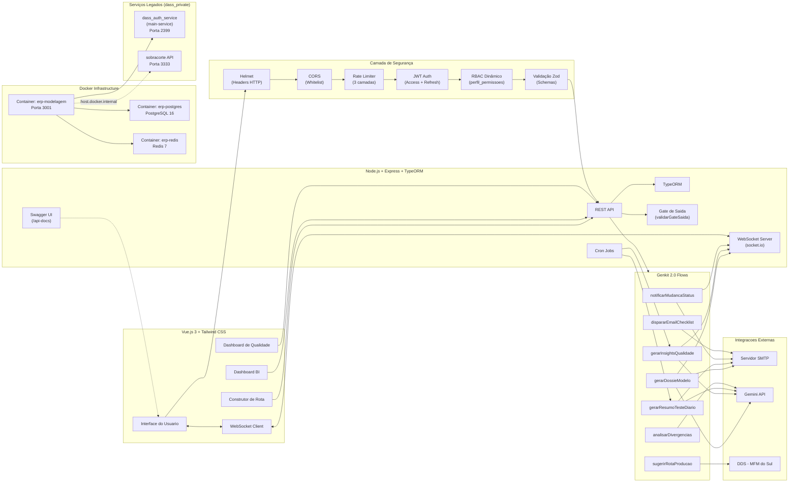

---

## 13. Pontos de Atenção Adicionais (v4.0)

> [!WARNING]
> ### Decisões pendentes (v4.0)
>
> 1. **Shared JWT Secret vs. Token Forwarding**: O ERP pode (A) compartilhar o mesmo `JWT_SECRET` do `dass_auth_service` para SSO transparente, ou (B) validar tokens do `dass_auth_service` via chamada HTTP `GET /protected`. Recomendação: opção (A) para menor latência.
> 2. **PostgreSQL compartilhado vs. dedicado**: O `docker-compose.yml` define um PostgreSQL dedicado (`erp-postgres`, DB `erp_modelagem`). Se preferir compartilhar o PostgreSQL do host (DB `sobracorte`), remova o serviço `erp-postgres` e aponte `DB_HOST=host.docker.internal`.
> 3. **TLS/HTTPS**: Em produção, recomenda-se um reverse proxy (Nginx/Traefik) com certificado TLS na frente do container `erp-modelagem`. O Helmet já habilita HSTS.
> 4. **Redis para Rate Limiting**: O `express-rate-limit` com `rate-limit-redis` garante consistência em múltiplas instâncias. Se rodar apenas 1 instância, o store em memória é suficiente para MVP.
> 5. **Swagger em produção**: Avaliar se `/api-docs` deve ser protegido por JWT em produção (recomendado). Configurar via variável `SWAGGER_ENABLED=true/false`.

